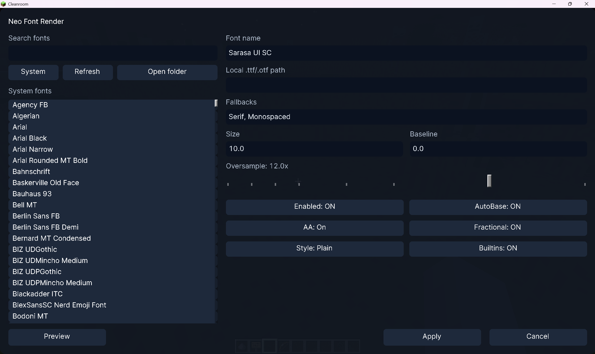

<p align="center">
  
</p>

<h1 align="center">Neo Font Render</h1>

<p align="center">
  面向 Cleanroom 的 Minecraft 1.12.2 现代文本整形与字体渲染模组。<br>
  <a href="README.md">English</a> · <a href="https://github.com/AndreaFrederica/NeoFontRender">GitHub</a><br><br>
  <a href="https://www.curseforge.com/minecraft/mc-mods/neofontrender"></a>
  <a href="https://www.curseforge.com/minecraft/mc-mods/neo-font-render-ui-enhancements"></a>
  <a href="https://www.mcmod.cn/class/27362.html"></a>
</p>

## 功能

Neo Font Render 用可配置的现代渲染器替代 Minecraft 1.12.2 的传统位图字体路径。

- **Cosmic Text** — 默认渲染器，提供原生文本整形与栅格化。
- **SFR/AWT** — 内置兼容渲染器，便于排障。
- 支持系统字体、本地 TTF/OTF、内置 Noto Sans SC、Noto Color Emoji 与 fallback 字体链。
- Unicode/IME 输入修复、告示牌粘贴与换行、可配置的告示牌优化。
- 游戏内模块化标签页设置界面与诊断命令。

<p align="center">
  
</p>

## 模块列表

项目由本体和若干可选模块组成，所有 UIE 模块共享同一个设置界面。

> **许可证说明：** 本体为 MIT。UI Enhancements 源码同样为 MIT，但发行 JAR 链接了 LGPL-3.0
> 库（Arc3D Core、ModularUI）并内嵌了 LGPL-2.1（Jazzy）和 Apache-2.0（TabbyChat、Salutation、
> jieba-analysis）组件，因此组合作品实际为 LGPL-3.0。详见 [NOTICE.md](addons/ui-enhancements/NOTICE.md)
> 及打包在 `META-INF/LICENSE-*` 中的完整许可证文本。

<table>
<thead>
<tr>
  <th></th>
  <th>模块</th>
  <th>Mod ID</th>
  <th>许可证</th>
  <th>说明</th>
</tr>
</thead>
<tbody>
<tr>
  <td></td>
  <td><b>Neo Font Render</b></td>
  <td><code>neofontrender</code></td>
  <td>MIT</td>
  <td>核心字体渲染器，包含 Cosmic Text 和 SFR/AWT 引擎、系统/内置字体支持、Unicode/IME 修复、告示牌优化及模块化设置界面。</td>
</tr>
<tr>
  <td></td>
  <td><b>NFR UI Enhancements</b></td>
  <td><code>neofontrender_ui_enhancements</code></td>
  <td>LGPL-3.0</td>
  <td>视觉与交互增强：聊天（内嵌 TabbyChat + Salutation）、工具提示、HUD 状态条、平滑滚动、文本输入、屏幕效果、悬停动画、世界加载、缩放。</td>
</tr>
<tr>
  <td></td>
  <td><b>UIE Server Companion</b></td>
  <td><code>neofontrender_ui_enhancements_server</code></td>
  <td>MIT</td>
  <td>服务端自身消息网络支持，用于聊天模块。可选，仅在独立服务器上需要。</td>
</tr>
</tbody>
</table>

### 内置模组（打包在 UIE 内）

<table>
<thead>
<tr>
  <th>模组</th>
  <th>Mod ID</th>
  <th>许可证</th>
  <th>说明</th>
</tr>
</thead>
<tbody>
<tr>
  <td><b>TabbyChat 2 Reforged</b></td>
  <td><code>tabbychat2</code></td>
  <td>Apache-2.0</td>
  <td>聊天频道标签、过滤器、防刷屏、按频道历史记录与日志。无需单独安装。</td>
</tr>
<tr>
  <td><b>Salutation 1.12.2</b></td>
  <td><code>salutation</code></td>
  <td>Apache-2.0</td>
  <td>命令树、参数解析器、多行聊天后端、睡眠聊天界面和高级 Tab 补全。无需单独安装。</td>
</tr>
</tbody>
</table>

### 聊天功能模块（UIE 内部）

| 模块 | 说明 |
| --- | --- |
| **搜索** | 聊天记录全文搜索，`Ctrl+F` 打开。 |
| **规则** | 基于正则的消息过滤与来源分类。 |
| **提及** | 从在线玩家列表补全 `@玩家名`，带提示音。 |
| **玩家链接** | 可点击的玩家名，右键菜单（私聊、提及、复制、屏蔽）。 |
| **命令补全** | 输入时显示可滚动的命令建议列表。 |
| **HUD 窗口** | 支持合成器的浮动聊天窗口。 |
| **持久化** | 按服务器/世界持久化收发消息历史。 |
| **拼写检查** | Jazzy（英文）+ 结巴（中文）拼写检查。 |

## 支持版本

| Minecraft | 分支 | 主要维护者 | 运行环境 |
| --- | --- | --- | --- |
| 1.12.2 | [`main`](https://github.com/AndreaFrederica/NeoFontRender) | [AndreaFrederica](https://github.com/AndreaFrederica) | Cleanroom + Java 25 |
| 1.7.10 | [`1.7.10`](https://github.com/AndreaFrederica/NeoFontRender/tree/1.7.10) | [DHJComical](https://github.com/DHJComical) | Forge + lwjgl3ify |

1.7.10 移植版共享核心渲染引擎与 API 接口，但目标运行环境为 Forge + lwjgl3ify 而非 Cleanroom。
详见 [`1.7.10` 分支](https://github.com/AndreaFrederica/NeoFontRender/tree/1.7.10)的版本专属文档和发行包。

## 环境与安装

- Minecraft 1.12.2 与 Cleanroom。
- Java 25。
- [ModularUI 3.1.6+](https://github.com/CleanroomMC/ModularUI)。

下载适合安装方式的发行包并放入 `mods` 文件夹。一般建议直接使用 `full` 包。

| 文件 | 使用场景 |
| --- | --- |
| `neofontrender-<version>-full.jar` | 完整的一体化安装。 |
| `neofontrender-<version>-core.jar` | 只使用核心渲染器与系统字体。 |
| `neofontrender-resources-<version>.jar` | 与 `core` 搭配，使用内置字体资源。 |

不要将 `full` 与拆分的 `core` 或 `resources` 包同时安装。

### UI Enhancements

将 `neofontrender-ui-enhancements-<version>.jar` 与本体一起放入 `mods`。服务端伴侣可选。

- [UI Enhancements Release 下载](https://github.com/AndreaFrederica/NeoFontRender/releases?q=ui-enhancements)
- [附属说明与构建方法](addons/ui-enhancements/README.md)

## 快速开始

按 `O` 打开设置界面；按 `P` 打开 emoji 测试界面。主配置文件位于：

```text
.minecraft/config/neofontrender.toml
```

自定义字体可放入：

```text
.minecraft/neofontrender/fonts/
```

新配置的默认渲染设置：

```toml
[font]
size = 8.5

[rendering]
engine = "cosmic"
interpolation = true
advancedStringMode = true
```

Cosmic 在缺字时会查询已配置的系统字体和内置资源。若其不可用，可在设置界面选择 `sfr` 使用兼容路径。

常用命令：

```text
/neofontrender info
/neofontrender fonts
/neofontrender reload
/neofontrender gui
```

## 外部集成 API

其他客户端 Mod 可以通过稳定 API 修改当前字体，无需直接操作 Neo Font Render 的内部配置或
renderer 类。`apply()` 可以从任意线程调用：更新会被调度到客户端线程，默认保存配置，并只重载
一次字体后端。

```java
import neofontrender.api.FontStyle;
import neofontrender.api.NeoFontRenderApi;
import neofontrender.api.RenderingEngine;

NeoFontRenderApi.updateFont()
        .font("Noto Sans SC")
        .fallbackFonts("Noto Color Emoji", "SansSerif")
        .size(8.5F)
        .style(FontStyle.PLAIN)
        .engine(RenderingEngine.COSMIC)
        .apply();
```

使用 `.persist(false)` 可进行仅当前会话生效的修改。`NeoFontRenderApi.getFontState()` 会返回包含
字体配置和当前后端的不可变快照。将本 Mod 作为可选依赖时，应先通过
`Loader.isModLoaded("neofontrender")` 判断是否已安装，再引用 API。提供给其他 Mod 复用的 GUI
基础组件位于 `neofontrender.client.gui.component.base`。

`font(...)` 会清除 Cosmic 的分字形覆盖，确保选中的字体族在各后端一致生效。需要分别指定
regular、bold、italic 与 bold-italic 字体文件时，可组合使用 `primaryFont(...)` 和
`cosmicFaceOverrides(...)`。

## 开发

项目已切换至当前的 [CleanroomModTemplate](https://github.com/CleanroomMC/CleanroomModTemplate)，使用 Gradle 9.6、Unimined、Cleanroom Loader 和 Java 25 工具链。

```bash
./gradlew runClient
./gradlew build
./gradlew packageVariants
```

`packageVariants` 会在 `build/libs` 生成 full、core 与 resources 三种发行包。本地构建会通过 Cargo 编译 Cosmic JNI；CI 会组装跨平台 native 集合。

## 项目信息

- 许可证：[MIT](LICENSE)
- 贡献者：[AndreaFrederica](https://github.com/AndreaFrederica)、[baka-gourd](https://github.com/baka-gourd)、[DHJComical](https://github.com/DHJComical)
- 设计文档：[docs](docs/)
