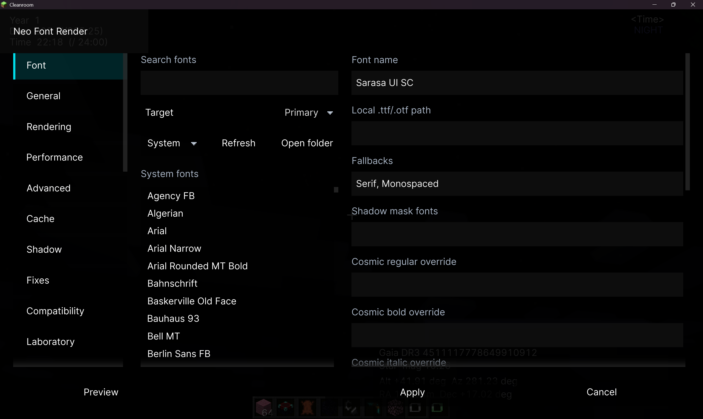
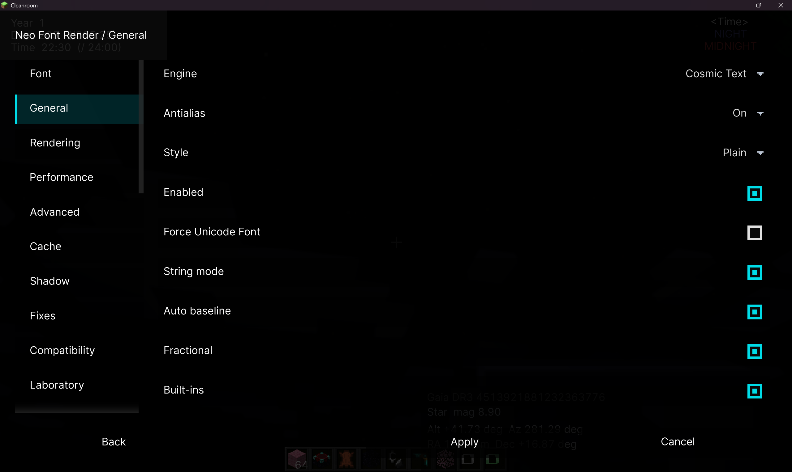
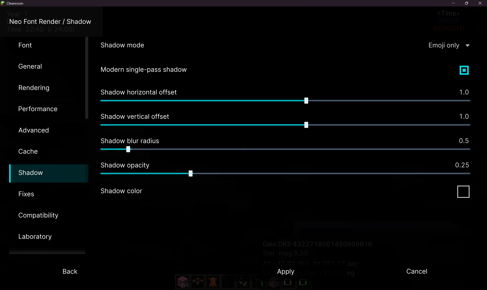
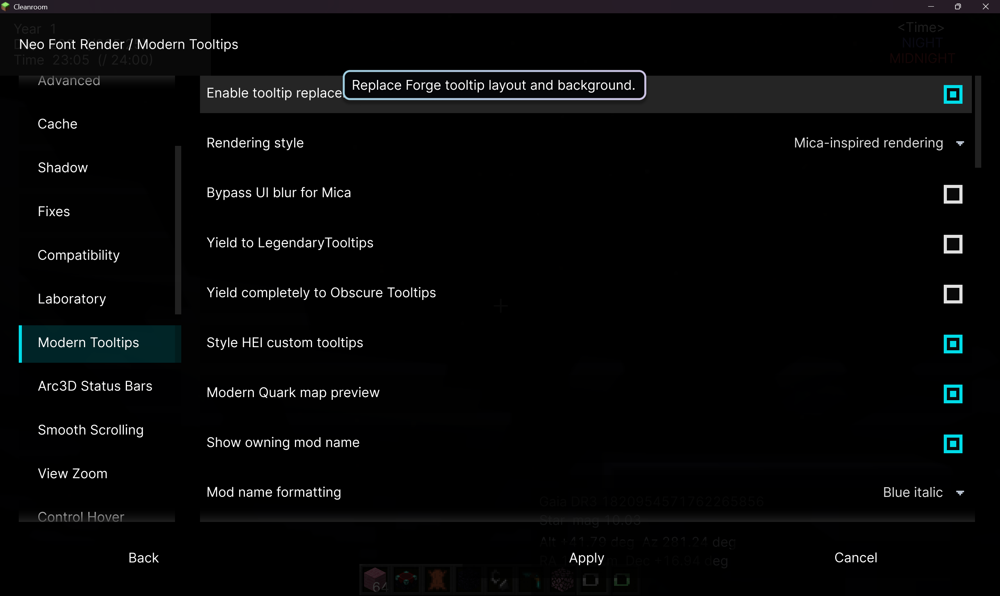

<p align="center">
  
</p>

<h1 align="center">Neo Font Render</h1>

<p align="center">
  面向 Cleanroom 的 Minecraft 1.12.2 现代文本整形与字体渲染模组。<br>
  <a href="README.md">English</a> · <a href="https://github.com/AndreaFrederica/NeoFontRender">GitHub</a><br><br>
  <a href="https://www.curseforge.com/minecraft/mc-mods/neofontrender"></a>
  <a href="https://www.curseforge.com/minecraft/mc-mods/neo-font-render-ui-enhancements"></a>
  <a href="https://www.mcmod.cn/class/27362.html"></a>
</p>

## 功能

Neo Font Render 用可配置的现代渲染器替代 Minecraft 1.12.2 的传统位图字体路径。

- **Cosmic Text** — 默认渲染器，提供原生文本整形、连字、字距调整、双向文本与 emoji ZWJ 序列支持。
- **SFR/AWT** — 内置 Java2D AWT 兼容渲染器，便于排障。
- 支持系统字体、本地 TTF/OTF/TTC 文件、内置 Noto Sans SC、Noto Color Emoji 与 fallback 字体链。
- 可变字体字重轴支持、Cosmic 分字形覆盖（regular/bold/italic）。
- 自适应光栅缩放（1.5x–14x）、mipmap、各向异性过滤与 GL 插值。
- 现代单通道阴影，可配置模糊半径、偏移、不透明度与颜色。
- 经典阴影模式控制（all/mask/emoji/none）与阴影遮罩规则。
- 高级字符串模式，对完整格式化字符串进行全跨度整形渲染。
- 增强与着色器文本管线，提升抗锯齿边缘质量。
- 亮度补偿与采样字形光栅自动检测。
- 段缓存，无需高级字符串模式即可高效渲染部分文本。
- Unicode/IME 输入修复、CJK 换行规则、文本撤销/重做。
- 告示牌粘贴（Ctrl+V）多行换行与可配置告示牌优化（LOD、视锥剔除、遮挡剔除）。
- TinkersAntique PUA 标记兼容与附魔台字体替换。
- Forge 加载界面与 ModernSplash 字体覆盖。
- 游戏内模块化标签页设置界面（12 个标签页），支持其他 Mod 的扩展 API。
- F3 调试叠加层，显示引擎、缓存与告示牌遮挡统计。
- Emoji 测试诊断界面、`/neofontrender` 命令套件。

<p align="center">
  &nbsp;&nbsp;
  <br>
  &nbsp;&nbsp;
  
</p>

## 模块列表

项目由本体和若干可选模块组成，所有 UIE 模块共享同一个设置界面。

> **许可证说明：** 本体为 MIT。UI Enhancements 源码同样为 MIT，但发行 JAR 链接了 LGPL-3.0
> 库（Arc3D Core、ModularUI）并内嵌了 LGPL-2.1（Jazzy）和 Apache-2.0（TabbyChat、Salutation、
> jieba-analysis）组件，因此组合作品实际为 LGPL-3.0。详见 [NOTICE.md](addons/ui-enhancements/NOTICE.md)
> 及打包在 `META-INF/LICENSE-*` 中的完整许可证文本。

<table>
<thead>
<tr>
  <th></th>
  <th>模块</th>
  <th>Mod ID</th>
  <th>许可证</th>
  <th>说明</th>
</tr>
</thead>
<tbody>
<tr>
  <td></td>
  <td><b>Neo Font Render</b></td>
  <td><code>neofontrender</code></td>
  <td>MIT</td>
  <td>核心字体渲染器，包含 Cosmic Text 和 SFR/AWT 引擎、系统/内置字体支持、Unicode/IME 修复、告示牌优化及模块化设置界面。</td>
</tr>
<tr>
  <td></td>
  <td><b>焕新UI</b></td>
  <td><code>neofontrender_ui_enhancements</code></td>
  <td>LGPL-3.0</td>
  <td>视觉与交互增强：聊天（内嵌 TabbyChat + Salutation）、工具提示、HUD 状态条、平滑滚动、文本输入、屏幕效果、悬停动画、世界加载、缩放。</td>
</tr>
<tr>
  <td></td>
  <td><b>UIE Server Companion</b></td>
  <td><code>neofontrender_ui_enhancements_server</code></td>
  <td>MIT</td>
  <td>服务端自身消息网络支持，用于聊天模块。可选，仅在独立服务器上需要。</td>
</tr>
</tbody>
</table>

### 内置模组（打包在 UIE 内）

<table>
<thead>
<tr>
  <th>模组</th>
  <th>Mod ID</th>
  <th>许可证</th>
  <th>说明</th>
</tr>
</thead>
<tbody>
<tr>
  <td><b>TabbyChat 2 Reforged</b></td>
  <td><code>tabbychat2</code></td>
  <td>Apache-2.0</td>
  <td>聊天频道标签、过滤器、防刷屏、按频道历史记录与日志。无需单独安装。</td>
</tr>
<tr>
  <td><b>Salutation 1.12.2</b></td>
  <td><code>salutation</code></td>
  <td>Apache-2.0</td>
  <td>命令树、参数解析器、多行聊天后端、睡眠聊天界面和高级 Tab 补全。无需单独安装。</td>
</tr>
</tbody>
</table>

### 焕新UI功能模块

| 模块 | 说明 |
| --- | --- |
| **现代工具提示** | 全面替代原版工具提示，圆角、柔和阴影、自适应边框颜色（基于品质/附魔）、Mica 半透明背景、居中标题布局、显示所属 Mod 名称。支持 HEI、Obscure Tooltips 与 Quark 地图兼容。 |
| **平滑滚动** | 滚轮动画滚动，覆盖原版 GuiSlot 列表、Forge 滚动列表、创造模式背包网格与聊天记录。可配置时长和步长。 |
| **屏幕效果** | 背景高斯模糊（后处理着色器）、四角渐变叠加与淡入/淡出过渡。按屏幕类型控制（菜单、容器、聊天）。 |
| **HUD 状态条** | 替代原版生命值、饱食度、护甲、韧性、气泡与坐骑血条。6 种视觉主题（modern、flat、glass、segmented、minimal、classic），平滑动画填充，自定义颜色，数字/图标显示。AppleCore 集成。 |
| **增强聊天** | 见子功能列表。 |
| **缩放** | 按住缩放按键，可配置倍率（2–8x），平滑镜头、鼠标灵敏度调整与动画 FOV 过渡。 |
| **悬停效果** | 原版/Forge 按钮、物品格、JEI/HEI 成分网格与 ModularUI 物品格的平滑交叉淡入动画。 |
| **世界加载** | 现代化世界加入与维度切换加载覆盖层。进度条、百分比、旋转器、底部渐变、淡出过渡、上次退出画面快照。 |
| **资源重载** | 资源包与语言切换时的进度覆盖层，含进度条、百分比与旋转器。 |
| **主菜单** | "继续游戏"按钮，直接重连上次游玩的世界或服务器。 |
| **创建世界** | 创建世界界面三种布局主题：vanilla、tabbed、modernui。 |
| **文本输入** | 原版与 ModularUI 文本框使用系统 I 型光标。 |

### 聊天子功能（UIE 内部）

| 功能 | 说明 |
| --- | --- |
| **标签聊天** | 内嵌 TabbyChat 2，频道标签、按频道历史记录与日志、防刷屏、时间戳、拼写检查、未读闪烁。 |
| **聊天搜索** | 聊天记录全文搜索，`Ctrl+F` 打开。 |
| **来源分类** | 基于正则的消息路由到玩家/服务器/私聊频道。 |
| **消息过滤** | 基于正则的消息屏蔽与按玩家静音。 |
| **@提及补全** | 从在线玩家列表实时补全 `@玩家名`，带提示音。 |
| **命令补全** | 输入时显示可滚动的 Tab 补全建议列表。 |
| **玩家链接** | 可点击的玩家名，双击交互、头像工具提示，右键菜单（私聊、密语、复制名称、屏蔽）。 |
| **玩家头像** | 在聊天消息旁渲染缓存的玩家头像。 |
| **物品图标** | 在 `SHOW_ITEM` 聊天组件旁显示物品图标。 |
| **时间戳** | 可配置的时间戳附加到聊天消息前。 |
| **复制粘贴** | 拖拽选中复制文本，支持格式化代码选项，`Ctrl+C/X/V/A` 快捷键。 |
| **右键菜单** | 聊天消息右键菜单，复制、玩家操作。 |
| **发送后保持** | 按消息来源类型控制发送后聊天窗口是否保持打开。 |
| **HUD 突口** | 支持合成器的浮动聊天窗口，持久化/分离布局。 |
| **持久化** | 按服务器/世界持久化收发消息历史（JSON）。 |
| **消息动画** | 新消息入场动画与聊天输入框开/关动画。 |
| **颜色主题** | 聊天面板完整颜色主题（背景、边框、输入框、托盘、标签、滚动条、文本 — 11 个颜色槽）。 |
| **拼写检查** | Jazzy（英文）+ 结巴（中文）拼写检查。 |

## 支持版本

| Minecraft | 分支 | 主要维护者 | 运行环境 |
| --- | --- | --- | --- |
| 1.12.2 | [`main`](https://github.com/AndreaFrederica/NeoFontRender) | [AndreaFrederica](https://github.com/AndreaFrederica) | Cleanroom + Java 25 |
| 1.7.10 | [`1.7.10`](https://github.com/AndreaFrederica/NeoFontRender/tree/1.7.10) | [DHJComical](https://github.com/DHJComical) | Forge + lwjgl3ify |

1.7.10 移植版共享核心渲染引擎与 API 接口，但目标运行环境为 Forge + lwjgl3ify 而非 Cleanroom。
详见 [`1.7.10` 分支](https://github.com/AndreaFrederica/NeoFontRender/tree/1.7.10)的版本专属文档和发行包。

## 环境与安装

- Minecraft 1.12.2 与 Cleanroom。
- Java 25。
- [ModularUI 3.1.6+](https://github.com/CleanroomMC/ModularUI)。

下载适合安装方式的发行包并放入 `mods` 文件夹。一般建议直接使用 `full` 包。

| 文件 | 使用场景 |
| --- | --- |
| `neofontrender-<version>-full.jar` | 完整的一体化安装。 |
| `neofontrender-<version>-core.jar` | 只使用核心渲染器与系统字体。 |
| `neofontrender-resources-<version>.jar` | 与 `core` 搭配，使用内置字体资源。 |

不要将 `full` 与拆分的 `core` 或 `resources` 包同时安装。

### 焕新UI

将 `neofontrender-ui-enhancements-<version>.jar` 与本体一起放入 `mods`。服务端伴侣可选。

- [焕新UI Release 下载](https://github.com/AndreaFrederica/NeoFontRender/releases?q=uie%2F)
- [附属说明与构建方法](addons/ui-enhancements/README.md)

## 快速开始

按 `O` 打开设置界面；按 `P` 打开 emoji 测试界面。主配置文件位于：

```text
.minecraft/config/neofontrender.toml
```

自定义字体可放入：

```text
.minecraft/neofontrender/fonts/
```

新配置的默认渲染设置：

```toml
[font]
size = 8.5

[rendering]
engine = "cosmic"
interpolation = true
advancedStringMode = true
```

Cosmic 在缺字时会查询已配置的系统字体和内置资源。若其不可用，可在设置界面选择 `sfr` 使用兼容路径。

常用命令：

```text
/neofontrender info
/neofontrender fonts
/neofontrender reload
/neofontrender gui
```

## 外部集成 API

所有 API 位于 `neofontrender.api` 包下，可作为可选依赖安全使用。引用前请先通过
`Loader.isModLoaded("neofontrender")` 判断是否已安装。提供给其他 Mod 复用的 GUI 基础组件
位于 `neofontrender.client.gui.component.base`。

### 字体配置 (`NeoFontRenderApi`)

通过稳定 API 修改当前字体，无需直接操作内部配置或 renderer 类。`apply()` 可从任意线程调用：
更新会被调度到客户端线程，默认保存配置，并只重载一次字体后端。

```java
import neofontrender.api.FontStyle;
import neofontrender.api.NeoFontRenderApi;
import neofontrender.api.RenderingEngine;

NeoFontRenderApi.updateFont()
        .font("Noto Sans SC")
        .fallbackFonts("Noto Color Emoji", "SansSerif")
        .size(8.5F)
        .style(FontStyle.PLAIN)
        .engine(RenderingEngine.COSMIC)
        .apply();
```

使用 `.persist(false)` 可进行仅当前会话生效的修改。`font(...)` 会清除 Cosmic 的分字形覆盖，
确保选中的字体族在各后端一致生效。需要分别指定 regular、bold、italic 与 bold-italic 字体文件
时，可组合使用 `primaryFont(...)` 和 `cosmicFaceOverrides(...)`。

其他入口：

| 方法 | 说明 |
| --- | --- |
| `NeoFontRenderApi.setPrimaryFont(String)` | 快捷方式：选择一个字体并持久化。 |
| `NeoFontRenderApi.reload()` | 不修改配置，仅调度后端重载。 |
| `NeoFontRenderApi.getFontState()` | 当前字体配置与活动后端的不可变快照。 |

### 现代文本渲染 (`ModernTextApi`)

引擎无关的文本渲染 API，以真实逻辑字号绘制文本。支持 Cosmic、SFR/AWT 和现代 AWT 适配器，
调用方无需关心当前后端。所有创建或绘制布局的方法必须在客户端渲染线程调用。

```java
import neofontrender.api.text.ModernTextApi;

if (ModernTextApi.isAvailable()) {
    float advance = ModernTextApi.draw("Hello", x, y, 12.0F, 0xFFFFFFFF);
}
```

| 方法 | 说明 |
| --- | --- |
| `isAvailable()` | 现代文本后端就绪时返回 `true`。 |
| `layoutFormatted(text, fontSize, argb, shadow)` | 将 Minecraft 格式化文本整形为可绘制的 `ModernTextLayout`。 |
| `layoutFormattedWithShadow(text, fontSize, argb)` | 前景 + 模糊现代阴影合一布局。 |
| `measureFormatted(text, fontSize, argb, shadow)` | 水平推进量（GUI 像素）。 |
| `drawFormatted(text, x, y, fontSize, argb, shadow)` | 快捷绘制并返回推进量。 |
| `canRenderModernShadow(text)` | 检查当前后端是否支持所有字形的现代模糊阴影。 |

### 高级文本渲染 (`AdvancedTextApi`)

调用方通过 `FontRenderSpec` 指定后端和字体族的作用域变体。适用于需要明确控制渲染器的场景
（如自定义 HUD 元素始终使用 Cosmic，不受用户全局设置影响）。

```java
import neofontrender.api.text.AdvancedTextApi;
import neofontrender.api.text.FontRenderSpec;

FontRenderSpec spec = FontRenderSpec.builder()
        .backend(FontRenderBackend.COSMIC)
        .family("Noto Sans SC")
        .size(10.0F)
        .build();

if (AdvancedTextApi.isAvailable(spec)) {
    AdvancedTextApi.drawFormatted(text, x, y, 0xFFFFFFFF, false, spec);
}
```

`drawWrapped(text, x, y, width, color, spec)` 在像素宽度约束内自动换行渲染，后端可用时返回 `true`。

### HUD 状态条 (`HudBarRegistry` — UIE)

其他客户端 Mod 可注册数据提供者，将自定义状态条添加到 NFR 的 Arc3D HUD。提供者选择
Forge 元素槽位和方向，返回 `HudBarValue`，默认保留空间而不取消原版渲染。仅当提供者显式
返回 `true` 时才会替代原版元素。命名空间 ID 和确定性排序允许多个集成共享同一高度栈。

```java
import neofontrender.addons.hud.api.*;

HudBarRegistry.register(new HudBarProvider() {
    @Override public String id() { return "mymod:mana"; }
    @Override public HudBarElement element() { return HudBarElement.FOOD; }
    @Override public HudBarSide side() { return HudBarSide.LEFT; }
    @Override public HudBarValue currentValue() {
        return new HudBarValue(getMana(), getMaxMana(), 0xFF4488FF);
    }
});
```

### 设置界面扩展

依赖 Mod 可向 NFR 的模块化设置界面添加自定义标签页，或向"关于"和"开源许可"页面贡献内容。

**设置标签页** — 实现 `NfrSettingsPage` 并注册：

```java
import neofontrender.api.client.settings.*;

NfrSettingsPageRegistry.register(new NfrSettingsPage() {
    @Override public String id() { return "mymod:settings"; }
    @Override public String titleKey() { return "mymod.gui.settings"; }
    @Override public int order() { return 100; }
    @Override public IWidget buildWidget(NfrSettingsPageContext ctx) {
        return new MySettingsPanel();
    }
});
```

**关于 / 开源许可贡献** — 向现有信息页面添加内容：

```java
NfrInfoPageRegistry.register(new NfrInfoPageContribution() {
    @Override public String id() { return "mymod:about"; }
    @Override public NfrInfoPage page() { return NfrInfoPage.ABOUT; }
    @Override public List<NfrInfoLine> lines() {
        return Arrays.asList(
            NfrInfoLine.spaced("My Mod v1.0", 0xFFFFFF),
            NfrInfoLine.line("github.com/example/mymod", 0x00DCE8));
    }
});
```

### 配置文件 (`NfrConfigApi`)

遵循 NFR 约定的 TOML 配置文件工厂（自动保存、校验、默认值）。使用 `NfrConfigStorage.INDEPENDENT`
创建独立文件，或 `APPEND_TO_NFR` 将键追加到 NFR 自身配置。

```java
import neofontrender.api.config.*;

NfrConfigFile config = NfrConfigApi.builder("mymod").open();
config.define("mymod.greeting", "Hello", "Greeting message.");
String greeting = config.getString("mymod.greeting", "Hello");
config.save();
```

### Arc3D 工具 (`Arc3DApi`)

NFR 分发的 Arc3D Core 2026.2.0 的稳定访问入口。原始 `icyllis.arc3d.*` API 同样可用且不会被重定向。

| 方法 | 说明 |
| --- | --- |
| `isAvailable()` | Arc3D Core 已加载且可用时返回 `true`。 |
| `lerp(from, to, amount)` | 线性插值。 |
| `hsv(h, s, v, alpha)` | HSV 转 ARGB 颜色。 |
| `lerpArgb(from, to, amount)` | 逐通道 ARGB 插值。 |

## 开发

项目已切换至当前的 [CleanroomModTemplate](https://github.com/CleanroomMC/CleanroomModTemplate)，使用 Gradle 9.6、Unimined、Cleanroom Loader 和 Java 25 工具链。

```bash
./gradlew runClient
./gradlew build
./gradlew packageVariants
```

`packageVariants` 会在 `build/libs` 生成 full、core 与 resources 三种发行包。本地构建会通过 Cargo 编译 Cosmic JNI；CI 会组装跨平台 native 集合。

## 项目信息

- 许可证：[MIT](LICENSE)
- 贡献者：[AndreaFrederica](https://github.com/AndreaFrederica)、[baka-gourd](https://github.com/baka-gourd)、[DHJComical](https://github.com/DHJComical)
- 设计文档：[docs](docs/)
