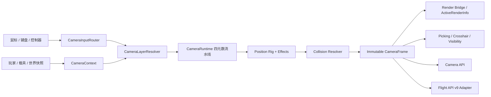

# UIE 统一相机平台架构与实施计划

> 状态：代码实现已覆盖统一输入、四元数相机、F5 透视循环、free-look、Drone、Shoulder 全部配置（含自适应物品/属性列表编辑）、统一相机拾取、准星路由、玩家透明度和外置模组 fail-closed；230 项单元测试、compileTestJava、remapJar、9 份 Mixin 配置（产物中另有 1 份 refmap）、751 组双语键与许可证/无新增 transformer 检查均已通过，当前仅剩客户端实机发布回归。
>
> 目标版本：Minecraft 1.12.2 / Forge / UI Enhancements。
>
> 本文中的类型名和伪代码用于固定模块边界；`api.camera` 当前为 API v2，保留 v1 的四元数值类型和内建 rig 工厂，并新增 provider/modifier/lens/picking/collision/observer 注册契约。

## 0. 当前实现快照

本轮代码已经完成以下用户可见行为：

- F5 是默认入口：原版第一人称、原版第三人称后、Shoulder、free-look、Drone、原版第三人称前按配置顺序循环。UIE 接管时消费原版 F5 分支，避免 `thirdPersonView` 被原版再次递增。
- 设置页 `camera` 已注册到 UIE 设置注册表，能够保存/取消 F5 插入开关、free-look 参数、Drone 碰撞/相机交互/速度/平移惯性/观察灵敏度/滚转速度、Shoulder 偏移/碰撞/居中、疾跑/乘客倍数、Valkyrien 碰撞、准星路由、玩家透明度，以及四个自适应物品/属性列表。
- F5 是视角模式的唯一默认入口；Drone/free-look/Shoulder 的独立切换键默认是 `NONE`。为了保留 Shoulder Surfing 的完整调节工作流，肩部模式激活时仍默认使用方向键调整水平/距离、PageUp/PageDown 调整高度、`O` 切换左右肩，所有按键均可在原版控制设置中重新绑定。
- Shoulder 准星不另建渲染系统：`RenderWorldLastEvent` 只用玩家四元数射线更新命中投影缓存，HUD 阶段由现有 `CrosshairController` 统一处理 Forge `CROSSHAIRS` claim、可见性、最终偏移、物品模组优先级和 dual secondary marker。原版、UIE、Flight HUD、Better Combat、TiC、Matter Overdrive 都从同一个最终 placement/offset 桥取值。
- Shoulder 透明度由 `RenderPlayer#doRender` Mixin 建立严格的局部作用域；作用域内的 `GlStateManager` Mixin 只钳制该玩家渲染过程中的 alpha/blend/depthMask，退出作用域后再恢复完整 GL 快照，不影响同帧世界或 HUD。Shoulder/FreeLook 保持玩家为 `renderViewEntity`，仅对 `RenderPlayer` 的本地用户快捷分支做精确放行，使玩家模型进入正常第三人称渲染；Drone/API 绝对位置仍使用显式代理。仍需在带 shader/盔甲/附魔 glint/载具的客户端实例中做最终像素回归。
- 检测到 `shouldersurfing` 或 `omnilook` 任一外置相机时，整套 UIE 内建 Shoulder/free-look/Drone session 均拒绝激活；旧的 `mixins...shouldersurfing*.json` 兼容链保持不变。

代码层已覆盖动态偏移、自适应物品/属性列表、Entity/Item/Boat 射线入口和可扩展碰撞 provider；仍需实机确认的范围是第三方 shader、Valkyrien 船体适配以及不同 Forge overlay 优先级组合。这些属于发布门禁回归，不改变 API 和所有权边界。

### 0.1 上游功能对照结论

| 上游功能面 | UIE 对应实现 | 自动校验 | 客户端门禁 |
|---|---|---|---|
| Shoulder 偏移、min/max/unlimited、六向调节、换肩 | `ShoulderCameraConfig`、`ShoulderCameraRig`、可重绑按键 | 配置/数学测试 | 实际手感与边界 |
| 乘客/疾跑倍率、爬梯居中、下视居中、动态空间、过渡 | quaternion rig + partial-tick anchor + 8 点碰撞 | rig/collision 测试 | 低顶、墙角、载具 |
| F5 替代第三人称、跳过前视、默认/记忆视角 | `CameraPerspectiveController` + 窄 F5 Mixin | 编译/Mixin 配置检查 | 完整循环与外部模组改变视角 |
| 五种 crosshair type、五种 visibility、custom ray/reach | `ShoulderCrosshairType/Visibility` + `CameraPickingService` | 路由/射线测试 | 方块、实体、Boat 实际交互 |
| adaptive hold/use item 与 property、插件 callback | 配置列表 + `CameraAdaptiveItemProvider` | API/匹配测试 | 第三方物品组合 |
| 原版、Better Combat、TiC、Matter Overdrive 准星 | 统一 placement/offset 桥 + scoped optional Mixins | Mixin/资源检查 | Forge overlay 优先级组合 |
| 玩家隐藏/几何透明度、shader resolution multiplier | RenderPlayer 严格作用域 + 最终 lens/viewport | 作用域源码检查、投影测试 | 盔甲、持有物、glint、shader 像素 |
| Valkyrien ship collision 开关 | 反射式船体空间转换/碰撞兼容 | 无链接依赖 | 指定 Valkyrien 版本实机 |
| Omnilook toggle/hold、第一人称临时第三人称、退出恢复 | F5/独立键 session + perspective lease | controller/input 单测 | 完整生命周期、外部切换与 GUI |
| Omnilook 独立 yaw/pitch，阻止玩家身体随视角转动 | 绝对世界 `FreeLookController` 四元数 + input claim | pitch/roll/解耦测试 | Flight 同时操纵 |
| 外置两模组兼容 | 任一外置相机存在即关闭整套内建模式；Shoulder 老修补链保留 | loader/Mixin 静态检查 | 真实外置 jar 共存 |

没有移植上游的裸 ASM、无作用域全局 GL 改写、HUD matrix 泄漏和重复配置键 bug；这些属于实现缺陷而不是用户功能。

## 1. 目标与范围

UIE 需要将以下能力合并到同一套相机底层，而不是继续维护彼此竞争的相机补丁：

- Shoulder Surfing 1.12.2-2.9.6 的完整功能。
- Omnilook 0.3 的完整自由观察和视角生命周期。
- UIE Flight API v9 现有三轴飞行、四元数跟踪、HUD 和玩家姿态能力。
- 新增四元数自由视角、旋转/位置惯性、相机 drag/sway 和六自由度无人机相机。
- 向其他模组提供稳定、只读优先、可仲裁的 Camera API。

强制约束：

1. 内核姿态、旋转组合、插值、角速度和碰撞坐标全部使用归一化四元数。
2. yaw/pitch/roll 只允许存在于 Minecraft、Forge 事件、配置和旧 API 兼容边界。
3. 每个渲染样本只能产生一个权威 `CameraFrame`。渲染、碰撞、准星、拾取和 API 必须消费同一帧。
4. 没有相机功能激活时必须走原版路径，不得无条件重写原版相机。
5. 无人机默认是纯客户端观察相机，不修改玩家位置，不扩大服务器交互距离。
6. 使用 Mixin、Forge 事件和普通 Java 服务实现，不引入新的裸 ASM transformer。
7. 现有 Shoulder Surfing 光标修补的 `patched/adaptive/static/dual/off` 五档语义、Forge overlay 生命周期和 TiC/Matter Overdrive 兼容不得回归。
8. 检测到外置 Shoulder Surfing 或 Omnilook 时，UIE 对应内置功能必须 fail closed；已存在的外置 Shoulder 光标修补 Mixin 必须继续按原链路工作。

第一阶段不包含：

- 让客户端无人机请求服务器加载玩家附近以外的区块。
- 默认允许从无人机相机位置破坏、放置或攻击。
- 将 Flight HUD、飞行网络同步或玩家模型姿态塞进通用 Camera API。
- 机械复制现代 Shoulder Surfing 的所有非 1.12.2 功能。现代实现只作为解耦、drag、sway 和 API 设计参考。

## 2. 研究基线与许可

| 项目 | 基线 | 许可 | 合入要求 |
|---|---|---|---|
| Shoulder Surfing | `352e39179f825a726d6f6651def2f3fe39b121f1` | MIT | 保留 Exopandora 版权和许可文本 |
| Omnilook | `94bcd88fa263e3bc069810c61a0d4121b6e01427` | Unlicense | 可自由复制；仍建议保留来源说明 |
| UIE Flight API | API v9 | 项目自身许可 | 保持现有公开二进制契约 |

实现前增加第三方来源清单。复制或实质改写的文件在文件头注明来源、版本和修改范围。

旧 Shoulder Surfing 中以下问题不得照搬：

- `hidePlayerWhenLookingUpAngle` 使用了重复的配置键。
- 动态准星可能 push GL matrix 后不 pop。
- 没有命中目标时 `projected` 可能保留上一帧结果。
- `zOffset == 0` 时动态空间扫描会产生 `0 / 0`。
- 五个全局 `GlStateManager` transformer 作用域过宽。
- 相机碰撞和射线只使用实体 yaw/pitch，无法跟随 UIE Flight 的 roll/完整四元数。

## 3. 核心设计决定

### 3.1 相机不是单一模式枚举

不能用 `SHOULDER`、`FREELOOK`、`FLIGHT`、`DRONE` 互斥枚举描述相机，因为以下组合都必须成立：

- Flight body attitude + shoulder position rig。
- Flight body attitude + free-look view coupling。
- Shoulder position rig + free-look + inertia。
- Vehicle anchor + shoulder offset + vehicle-provided collision。

因此运行时按阶段组合，每个排他阶段只有一个权威所有者：

| 阶段 | 职责 | 示例所有者 |
|---|---|---|
| `ANCHOR` | 相机依附点和线速度 | 玩家、载具挂点、无人机 |
| `BODY_ATTITUDE` | 物理机体/玩家基准姿态 | 原版实体、Flight provider |
| `VIEW_COUPLING` | 从机体姿态得到观察目标姿态 | 跟随、free-look、瞄准锁定 |
| `POSITION_RIG` | 从锚点得到目标相机偏移 | 第一人称、第三人称、肩视角 |
| `COLLISION` | 将目标位置约束到可见空间 | Vanilla、Shoulder 8 点、no-clip |
| `PICKING` | 视觉目标和实际交互射线 | 玩家、投影双射线、禁用 |
| `LENS` | FOV、近裁剪面和镜头参数 | 原版、瞄准、过场动画 |
| `LISTENER` | 声音监听点 | 玩家、最终相机位置 |

`EFFECT` 是可组合阶段，不是排他阶段。惯性、drag、sway、震动按稳定顺序执行。

### 3.2 两套姿态，只有一套数学

- `bodyAttitude`：玩家、载具或飞行器的物理姿态，可用于 HUD、玩家模型和网络同步。
- `viewAttitude`：最终相机姿态，用于渲染、肩部偏移、碰撞基向量和相机射线。

自由观察进入时快照最终姿态，激活期间保持绝对世界姿态：

```text
absoluteLookAttitude = currentViewAttitude  // enter once
viewAttitude = absoluteLookAttitude         // while active; body may rotate independently
```

肩视角目标位置：

```text
desiredPosition = anchorPosition + viewAttitude.rotate(localShoulderOffset)
```

这条规则保证 roll 后的肩部左右、上方、后方、8 点碰撞和拾取都处在同一坐标系。

#### 3.2.1 姿态必须在状态、所有权和回写上彻底解耦

这不是只在 `CameraFrame` 中放两个字段。运行时必须保存两份相互独立的持续状态，并规定唯一写入者：

```java
final class CameraPersistentState {
    // 物理实体/飞行器状态：由原版实体、Flight 或载具 provider 拥有。
    BodyAttitudeState body;

    // 观察状态：由 free-look、drone、过场和惯性效果拥有。
    ViewAttitudeState view;
}

final class ViewAttitudeState {
    CameraAttitude absoluteLook;       // 世界空间自由观察快照，不写入或跟随 body
    OrientationSpringState inertia;    // 只平滑最终 view
    CameraAttitude lastRenderedView;   // 连续四元数半球/欧拉边界桥接
}
```

写入规则：

- `BodyAttitudeState` 表示玩家/载具实际朝向。Flight 的三轴操纵、玩家模型、飞行网络同步和载具物理只读取或修改它；free-look、肩视角、相机惯性和 Drone 绝不写它。
- `ViewAttitudeState` 表示渲染、镜头偏移、碰撞、可见性、投影和相机射线的朝向。进入 free-look 时从最终观察姿态建立绝对世界四元数快照；后续鼠标输入只更新该快照，惯性只更新 view 的弹簧状态。
- 默认跟随关系为 `view = body`。自由观察激活后 `view = absoluteLook`，不再乘以变化中的 body。因此 Flight 可继续转动玩家机体，而玩家看到的方向不会被机体旋转拖走。
- Drone 持有独立的 `droneViewAttitude` 和 position/velocity；它可完全不依赖玩家 `bodyAttitude`。退出 Drone 仅释放 session，不能把 drone 朝向或位置回写到玩家。
- 原版 `rotationYaw` / `rotationPitch` 仅是边界镜像：未被 UIE 相机层声明的 LOOK 输入走原版 `EntityPlayerSP.turn()`；需要旧渲染/事件兼容时，由 `ContinuousEulerBridge` 从权威姿态生成临时欧拉值。该镜像不得反向成为 `bodyAttitude` 或 `viewAttitude` 的状态来源。
- 只有明确声明了“玩家物理转向”的 input provider（例如 Flight maneuver）可以更新 `BodyAttitudeState`。普通自由视角绝不能因退出、视角切换或渲染回调而把相机 yaw/pitch 回写给玩家。

每个 `CameraFrame` 同时发布 `bodyAttitude`、`viewAttitude`、两者的 basis 和各自的来源/版本号。公开 API 必须让消费者显式选择物理基准还是观察基准，不能继续暴露含义模糊的 `getCameraRotation()`：

```java
CameraAttitude frame.bodyAttitude(); // 玩家/载具的物理姿态
CameraAttitude frame.viewAttitude(); // 最终观察/渲染姿态
CameraBasis frame.bodyBasis();
CameraBasis frame.viewBasis();
```

这让 HUD、飞行控制器和网络代码有稳定的物理参考，而渲染、屏幕投影、准星和无人机工具始终使用最终观察参考。

### 3.3 坐标约定

沿用 `FlightAttitude` 的右手坐标系：

- 世界：`+X east`、`+Y up`、`+Z south`。
- 相机/飞行器局部：`+Z forward`、`+Y up`、`+X left`、`-X right`。
- 四元数表示“局部坐标到世界坐标”的旋转。
- 组合 `a.multiply(b)` 表示先采用世界姿态 `a`，再施加局部旋转 `b`。

`CameraAttitude` 必须归一化输入，并提供：

```java
final class CameraAttitude {
    double x, y, z, w;

    static CameraAttitude identity();
    static CameraAttitude axisAngle(CameraVector axis, double radians);
    static CameraAttitude fromMinecraftEuler(double pitch, double yaw, double roll);

    CameraAttitude multiply(CameraAttitude localRotation);
    CameraAttitude conjugate();
    CameraAttitude slerp(CameraAttitude target, double amount);
    CameraVector rotate(CameraVector localVector);
    CameraVector forward();
    CameraVector right();
    CameraVector up();

    // 只给 Forge/Minecraft/旧 API 边界使用。
    ContinuousEuler toMinecraftEuler(ContinuousEuler previousBranch);
}
```

不得在内核控制器中通过 `toMinecraftEuler()` 修改状态后再转回四元数。

## 4. 总体数据流



权威帧的最小数据模型：

```java
final class CameraFrame {
    long sampleId;
    float partialTicks;
    CameraModeFlags flags;

    CameraAnchor anchor;
    CameraAttitude bodyAttitude;
    CameraAttitude targetViewAttitude;
    CameraAttitude viewAttitude;

    CameraVector targetPosition;
    CameraVector position;
    CameraBasis basis;
    CameraVector linearVelocity;
    CameraVector angularVelocity;

    CameraLens lens;
    CollisionResult collision;
    PickingFrame picking;

    boolean isVanillaPassThrough();
}
```

约束：所有向量有限、所有姿态归一化；`basis` 必须从同一个 `viewAttitude` 派生；`position` 必须是碰撞后的最终位置；构造后不可变。

每个 rendered frame 的伪代码：

```java
CameraFrame CameraRuntime.sample(float partialTicks) {
    assertClientThread();

    CameraContext context = contextFactory.capture(mc, partialTicks);
    CameraInputFrame input = inputRouter.drain(context);
    ResolvedLayers layers = layerResolver.resolve(context, activeSessions);

    AnchorSample anchor = layers.anchor.sample(context);
    CameraAttitude body = layers.bodyAttitude.sample(context, anchor);
    CameraAttitude targetView = layers.viewCoupling.resolve(context, input, body);

    CameraAttitude renderedView = orientationEffects.apply(
            context.timeStep, targetView, persistentState.orientation);

    CameraOffset targetOffset = layers.positionRig.resolve(
            context, input, anchor, body, renderedView);
    CameraOffset renderedOffset = positionEffects.apply(
            context.timeStep, targetOffset, anchor.velocity,
            renderedView, persistentState.position);

    CameraVector desiredPosition = anchor.position
            .add(renderedView.rotate(renderedOffset.localVector));
    CollisionResult collision = layers.collision.resolve(
            context, anchor.position, desiredPosition, renderedView);

    CameraBasis basis = CameraBasis.from(renderedView);
    PickingFrame picking = layers.picking.resolve(
            context, anchor, collision.position, body, renderedView, basis);

    CameraFrame frame = CameraFrame.builder(context.sampleId)
            .anchor(anchor)
            .bodyAttitude(body)
            .viewAttitude(renderedView)
            .targetPosition(desiredPosition)
            .position(collision.position)
            .basis(basis)
            .collision(collision)
            .picking(picking)
            .lens(layers.lens.resolve(context))
            .flags(layers.flags())
            .build();

    framePublisher.publish(frame);
    return frame;
}
```

同一个 `sampleId + partialTicks` 只能计算一次。后续消费者取得缓存帧，不得各自重新查询 provider 或重新选择欧拉分支。

## 5. 输入路由

当前 `FlightRollController` 在 `CameraMouseInputEvent` 最低优先级直接改玩家 yaw/pitch，并单独保存 roll。合并后由 `CameraInputRouter` 唯一读取相对鼠标输入。

```java
enum CameraInputChannel {
    LOOK_X, LOOK_Y,
    FLIGHT_PITCH, FLIGHT_YAW, FLIGHT_ROLL,
    TRANSLATE_X, TRANSLATE_Y, TRANSLATE_Z,
    ZOOM
}

final class CameraInputFrame {
    long sampleId;
    double frameSeconds;
    Map<CameraInputChannel, Double> axes;
    Set<CameraInputChannel> claimed;

    double claim(CameraInputChannel channel, ResourceLocation owner);
}
```

处理顺序：

1. Mixin 读取原始 `MouseHelper.deltaX/deltaY`。
2. 发布现有 `CameraMouseInputEvent`，保持第三方修改/取消兼容。
3. 对未取消的输入应用一次 vanilla/Zoom sensitivity 变换。
4. 当前 layer owners 按通道 claim 输入。
5. 未 claim 的 LOOK 输入回落到原版 `EntityPlayerSP.turn()`。

Flight、free-look 和 drone 不能重复消费同一 LOOK 轴。Flight maneuver provider 可以消费 `FLIGHT_*`，同时 free-look 消费 `LOOK_*`，从而允许飞行操纵和观察头部解耦。

兼容事件现在明确区分两组轴：`deltaX/Y` 是原版玩家 body/旧 Flight 链，`cameraDeltaX/Y` 是 detached camera 链。旧的 `setDelta*` 和 `consume*` 同时影响两组轴以保持历史语义；`consumeBodyHorizontal/Vertical` 只消费 body，因此 Flight 可继续接管玩家物理姿态而不偷走 free-look/Drone 的观察输入。事件取消仍会原子地消费两组轴。

### 5.1 完整输入 API：设备、动作、上下文与仲裁分层

相机不能直接读取鼠标、键盘或某个手柄库。输入底层必须位于 `api.input`，相机、Flight、HUD、载具和第三方集成都只读取同一个不可变逻辑快照。这样既能在后续接入 GLFW/LWJGL Controller、Steam Input 或手柄模组，又不会让它们绕过无人机的操纵断开规则。

```text
Mouse / keyboard / controller / external adapter
        -> InputDeviceSample (原始、带设备和时间戳)
        -> InputBindingMap (dead-zone、曲线、反转、组合键)
        -> InputContextRouter (claim / block / pass 仲裁)
        -> InputFrame (每渲染样本只读逻辑动作)
        -> CameraRuntime / Flight virtual stick / Drone / 玩家原版桥接
```

`InputAction` 不是按设备划分，而是按游戏含义划分：

```java
enum InputAction {
    // 相机观察；不会天然改变玩家物理姿态。
    CAMERA_LOOK_X, CAMERA_LOOK_Y, CAMERA_ROLL, CAMERA_ZOOM,

    // 独立相机/无人机平移，局部坐标。
    CAMERA_TRANSLATE_X, CAMERA_TRANSLATE_Y, CAMERA_TRANSLATE_Z,

    // Flight API v9 的虚拟摇杆，语义与 FlightManeuverInput 保持一致。
    FLIGHT_PITCH, FLIGHT_YAW, FLIGHT_ROLL, FLIGHT_RUDDER,

    // 玩家物理操纵和交互；不能被相机模式意外透传。
    PLAYER_MOVE_FORWARD, PLAYER_MOVE_STRAFE, PLAYER_JUMP, PLAYER_SNEAK,
    PLAYER_SPRINT, PLAYER_ATTACK, PLAYER_USE, PLAYER_PICK_BLOCK,
    PLAYER_DROP, PLAYER_INVENTORY,

    // 全局但仍可受 GUI/死亡等状态约束的模式命令。
    CAMERA_TOGGLE_DRONE, CAMERA_EXIT_DRONE, CAMERA_TOGGLE_FREELOOK
}

enum InputDisposition { PASS, CLAIM, BLOCK }

final class InputContext {
    ResourceLocation id;
    int priority;
    Set<InputAction> claimed;
    Set<InputAction> blocked;
    InputTransform transform; // 可选，处理手柄曲线、速率限制或重映射
}
```

仲裁使用 priority 降序、namespaced id 升序；一个动作的第一个 `CLAIM` 或 `BLOCK` 决定去向。`BLOCK` 产出可诊断的中性值，不能简单“不读取”，避免某一帧恰好留下 Flight/移动的上一帧轴值。动作在每个 `sampleId` 只能结算一次；同一帧所有 API 读取同一 `InputFrame`。

公开 API 拟定如下：

```java
public final class InputApi {
    public static final int API_VERSION = 1;

    public static InputRegistration registerDeviceSource(ResourceLocation id, int priority,
                                                          InputDeviceSource source);
    public static InputRegistration registerBindingProvider(ResourceLocation id, int priority,
                                                            InputBindingProvider bindings);
    public static InputRegistration registerContextProvider(ResourceLocation id, int priority,
                                                            InputContextProvider provider);
    public static InputFrame getFrame(float partialTicks);
    public static InputFrame beginFrame(float partialTicks, boolean gameFocused);
    public static InputFrame flush(InputFlushReason reason);
    public static InputDiagnostics diagnostics();
    public static InputRegistration registerFrameObserver(ResourceLocation id, int priority,
                                                          InputFrameObserver observer);
}

final class InputFrame {
    long sampleId;
    double frameSeconds;
    InputValue value(InputAction action); // axis [-1, 1] 或 button pressed/held/released
    InputDisposition disposition(InputAction action);
    ResourceLocation owner(InputAction action); // null 仅表示 vanilla PASS
    FlightManeuverInput flightManeuver(EntityPlayerSP player, float partialTicks);
}
```

手柄适配器只注册 `InputDeviceSource` 和 binding，不接触 Mixin 或 `EntityPlayerSP.turn()`。实现必须支持 dead-zone、响应曲线、反转、按钮边沿、断连时自动归零、同动作多设备合成（axis 按绝对值较大的来源选择，button 按 OR）；禁止将手柄视为鼠标 delta 再喂给原版。

### 5.2 Drone 输入上下文与“断开操纵”协议

切换至无人机不是只把镜头移走，而是一个输入模式事务：

1. 获取 Drone `CameraSession` 前，保存当前有效 `InputContext` 版本和玩家按键状态；若相机 session 不能完全激活，不切换输入。
2. 原子安装 `uie:drone` 高优先级 context：`CAMERA_LOOK_*`、`CAMERA_TRANSLATE_*`、`CAMERA_ZOOM` 由 Drone claim；所有 `PLAYER_*` 和 `FLIGHT_*` 由 Drone `BLOCK`。
3. 在安装时和释放时各发布一个中性 `FlightManeuverInput`，清除 Flight 鼠标动量、虚拟摇杆/HUD 残留和任何手柄持续轴。Drone 不向 Flight maneuver handler 分派自己的相机输入，除非一个显式、授权的 `DroneFlightBridge` context 接管该职责。
4. 原版桥接只对 `PASS` 的 `PLAYER_*` 调用/保留原版输入。被 `BLOCK` 的移动键、attack/use/pick/drop 必须在同一 tick 清零，不能只取消一次 mouse event；GUI、聊天、ESC 与 `CAMERA_EXIT_DRONE` 按普通 UI/全局规则保留。
5. 退出、死亡、世界卸载、断线、失焦或 session `SUSPENDED` 时先撤销 Drone context，再清空输入快照和设备持续状态，最后释放 camera session。绝不把按住的 Drone 平移或观察量泄漏为下一帧玩家转向/移动。

```java
DroneModeHandle enterDrone(request) {
    CameraSession camera = CameraApi.acquire(request);
    if (!camera.isActive()) return DroneModeHandle.rejected();

    InputRegistration input = InputApi.pushContext(DRONE_CONTEXT);
    InputApi.flush(InputFlushReason.MODE_ENTER); // 输出中性 Flight/玩家动作
    return new DroneModeHandle(camera, input);
}

void closeDrone() {
    input.close();
    InputApi.flush(InputFlushReason.MODE_EXIT);
    camera.close();
}
```

这里的“断开操纵”是默认安全行为。以后若某个真实载具/无人机需要让 Flight 虚拟摇杆继续控制实体，必须通过高于 `uie:drone` 的显式 bridge 声明它接收哪些 `FLIGHT_*` 动作、是否允许交互和其服务器授权；不能以隐式例外破坏默认隔离。

### 5.3 当前实现状态与迁移边界

本阶段已实现输入底层的第一批代码骨架：

- `api.input.InputAction`、`InputValue`、`InputDeviceSample`、`InputBinding` 提供设备无关的逻辑动作、边沿状态、死区、缩放、反转和断连空样本。
- `InputApi` 提供设备源、binding、context、observer 注册，按 priority/id 确定性仲裁 `PASS/CLAIM/BLOCK`，并发布不可变单样本 `InputFrame`。
- `VanillaInputBridge` 已在原始鼠标采样点发布键鼠设备快照；手柄或虚拟摇杆可通过同一 device/binding API 接入。
- `DroneInputGuard` 已定义高优先级无人机上下文，进入/退出时发送 neutral flush 并立即停止当前疾跑；`MixinMovementInputFromOptionsDroneGate` 和 `MixinMinecraftDroneInputGate` 已阻断移动、热栏、丢弃、换手、背包、pick、attack/use（按配置）及持续挖掘。允许 Drone 交互时 attack/use 改走 Drone 最终相机射线。
- 现有 `MixinEntityRendererMouseInputEvent` 在原鼠标采样边界捕获并结算输入帧，旧 `CameraMouseInputEvent` 仍按原顺序发布；Flight 的旧虚拟摇杆和 controller event 保持兼容路径。
- `FlightRollController` 在 Flight 轴被 `BLOCK` 时会清除 momentum 并只消费 body 鼠标轴，防止 Drone 模式退出后残留转向，同时不破坏 free-look 与 Flight 虚拟摇杆并行。
- `InputFrameContext` 保留 `InputFlushReason`；`InputApi.diagnostics()` 提供当前 flush 原因、活动 context、动作 owner/disposition 和设备/binding/observer 注册快照。Input/Flight/Camera 扩展及 backend 错误均写 ERROR 并重抛原异常。
- 失焦帧不采样设备并立即发布中性值，同时关闭 F5/独立键持有的 session；死亡、世界卸载和断线也会关闭两类 owner，清空 Vanilla 设备边沿历史、释放相机代理并发送对应 flush。
- `api.camera` 已提供四元数 `CameraAttitude`、`CameraVector`、`CameraBasis`、不可变 `CameraFrame`、`CameraApi` 和最小 `CameraSession`；`CameraRuntime` 在输入采样边界更新缓存帧，API 读取缓存而不会重复采样。
- Drone 已有独立的四元数 look、局部平移和速度阻尼控制器；`CameraSetup` 在 Drone/free-look/Shoulder 或 Flight quaternion tracking 帧活跃时作为 Forge 角度兼容桥接，玩家 body 姿态不被回写；外置 Omnilook 存在时让出最终视角。Shoulder/free-look 不替换 `renderViewEntity`，Drone/API 绝对位置才使用代理。
- Free-look 已有独立绝对世界四元数和输入 guard，只 claim `CAMERA_LOOK_*`，不会阻断 Flight 的 `FLIGHT_*` 虚拟摇杆，也不会在 Flight 改变 body 姿态时被动跟随。
- `CameraMeasurement`、`CameraProjection`、`CameraRay`、`AxisAlignedBounds`、`ScreenBounds`、`CameraHorizon`、`CameraRelativePose` 已提供只读的点/AABB 投影、六平面视锥、屏幕地平线、相对姿态、屏幕射线和交互目标测量，全部从缓存 `CameraFrame.viewAttitude` 推导。
- `CameraApi.getPosition/setPosition/clearPositionOverride` 提供最终相机原点的读取和显式覆盖；覆盖不改变 body/view quaternion，清除后恢复当前 rig。`CameraApi.diagnostics()` 暴露 active rig/session owner、frame/modifier/lens/picking/collision/adaptive 仲裁结果和外置 Mod fail-closed 原因。
- `CameraExternalCompat` 在不加载第三方类的前提下检测 Shoulder Surfing/Omnilook；外置 Omnilook 存在时 UIE free-look session 拒绝激活，外置 Shoulder 的旧 compat Mixin 链仍保持独立。
- F5 与可选独立切换键分别通过 `CameraSessionOwner` 持有 `CameraProvider.acquire()` 返回的 session；provider 自行失效会在 tick 中被发现并释放，替换、退出、死亡、失焦、卸载和断线均不会遗留第三方租约。

当前仍保留的兼容层：`FlightManeuverInput` 继续通过 `FlightInputAdapter` 服务旧调用方；原版第三人称视锥裁剪由精确的 `orientCamera` 距离注入配合 Forge `CameraSetup` 处理，不新增全局裁剪器。统一 `getMouseOver` 拾取、完整 Shoulder 配置/rig、8 点相机碰撞、换肩热键/API、Drone 碰撞/交互安全策略、Shoulder 准星路由、相机附近玩家透明度和外置模组 fail-closed 已落地。

## 6. Layer 仲裁与会话

普通 provider 按 priority 降序、namespaced id 升序稳定查询；第一个返回非空 frame 的 provider 成为本样本所有者，随后再按同样稳定顺序应用 modifier。需要持续生命周期的无人机、过场或载具通过 session 激活：

```java
CameraRigRequest request = new CameraRigRequest(id, priority);
CameraSession session = CameraApi.acquire(request);
```

`CameraRigRequest` 当前只携带稳定 id 和调用方优先级；provider 通过 `supports(request)` 决定是否承接，并在 `acquire(request, context)` 中一次性建立自己的内部状态和输入租约。内建 Drone/free-look/Shoulder session 若任何必需资源无法建立就返回 inactive session，不暴露半激活模式。

公开入口保持小而稳定；当前实际契约是 API v2：

```java
public final class CameraApi {
    public static final int API_VERSION = 2;

    public static CameraFrame getFrame(float partialTicks);
    public static CameraMeasurement measure(float partialTicks);
    public static CameraProjection project(CameraVector world, float partialTicks);
    public static CameraRay screenRay(double pixelX, double pixelY, float partialTicks);
    public static boolean isWithinFrustum(AxisAlignedBounds bounds, float partialTicks);
    public static ScreenBounds projectBounds(AxisAlignedBounds bounds, float partialTicks);
    public static CameraHorizon horizon(float partialTicks);
    public static CameraRelativePose relativeTo(CameraVector world, float partialTicks);
    public static CameraHit interactionTarget(CameraPickingPurpose purpose, float partialTicks);
    public static CameraHit pick(CameraPickingRequest request);
    public static CameraVector resolveCollision(CameraCollisionQuery query);

    public static CameraVector getPosition(float partialTicks);
    public static void setPosition(CameraVector position);
    public static void setPosition(double x, double y, double z);
    public static void clearPositionOverride();
    public static boolean hasPositionOverride();
    public static CameraDiagnostics diagnostics(float partialTicks);

    public static CameraRegistration registerProvider(CameraProvider provider);
    public static CameraRegistration registerModifier(CameraModifier modifier);
    public static CameraRegistration registerLensProvider(CameraLensProvider provider);
    public static CameraRegistration registerPickingProvider(CameraPickingProvider provider);
    public static CameraRegistration registerCollisionProvider(CameraCollisionProvider provider);
    public static CameraRegistration registerAdaptiveItemProvider(CameraAdaptiveItemProvider provider);
    public static CameraRegistration registerFrameObserver(CameraFrameObserver observer);

    public static CameraSession acquire(CameraRigRequest request);
}
```

普通效果和 HUD 模组应只读取 frame 或注册 modifier。只有载具、Drone、过场动画等确实需要持续控制权的集成才申请 session。API 不提供“直接修改最终矩阵”回调。

最终相机原点可由客户端线程显式读取或覆盖：

```java
CameraVector previous = CameraApi.getPosition(partialTicks);
CameraApi.setPosition(new CameraVector(x, y, z));
try {
    // 后续 CameraFrame、测量、拾取和渲染代理读取同一个覆盖原点。
} finally {
    CameraApi.clearPositionOverride();
}
```

`setPosition` 是持久的最终 origin override，不开启 Drone、不移动玩家，也不改变 body/view quaternion；它位于 provider + modifier 之后并触发 UIE view proxy。调用方必须在所有退出路径清除覆盖。需要同时控制位置和姿态、输入所有权或模式生命周期时，应使用 `CameraProvider`/`CameraSession`，而不是分别写入玩家欧拉角。

第三方 `CameraProvider` 的渲染所有权有两个明确层级：`ownsView()` 表示其最终 frame 应成为本样本权威视图；若集成方没有自己的 render-view entity，再返回 `requiresUiViewProxy() = true`，UIE 才会创建和维护 client-only 代理实体。代理使用 provider + modifier 后的最终 frame，同步位置/姿态，并在 provider 让出、注销、世界卸载、断线或内建 session 开始前恢复原 render entity 和原视角。已有自管 render-view entity 的集成必须保持 `requiresUiViewProxy() = false`，避免双重代理。

provider、modifier、lens、picking、collision、adaptive callback、observer、backend、`id()`、`priority()` 和 session 控制回调的运行时异常均先按稳定 owner 和操作名写 ERROR 日志，再把同一个异常实例抛给当前调用者。注册时 `id` 必须非空且可读取。API 不静默跳过故障 provider，也不返回伪造 fallback；调用者可从异常堆栈和 `CameraDiagnostics` 同时定位责任层。

### 6.1 API 同时是测量与空间查询 API

相机 API 不能只允许第三方移动或旋转相机。第三方 HUD、瞄准辅助、摄影工具、载具仪表、回放系统和交互模组更常见的需求是：在不拥有相机控制权的情况下，稳定地测量当前相机、屏幕、世界坐标、目标和可见性。

因此 `CameraFrame` 是 API 的主入口，公开且不可变；控制接口和测量接口严格分开：

```java
public final class CameraApi {
    // 每个渲染样本只读快照；绝大多数集成只需要这些。
    public static CameraFrame getFrame(float partialTicks);
    public static CameraMeasurement measure(float partialTicks);

    public static CameraProjection project(CameraVector world, float partialTicks);
    public static CameraRay screenRay(double pixelX, double pixelY, float partialTicks);
    public static CameraHit pick(CameraPickingRequest request);

    // 高权限控制接口；要求明确 provider/session。
    public static CameraRegistration register...;
    public static CameraSession acquire(CameraRigRequest request);
}

final class CameraMeasurement {
    long sampleId;
    CameraFrame frame;
    CameraLens lens;                // 最终 viewport、vertical FOV、aspect、near/far
    CameraProjection project(CameraVector world);
    CameraRay screenRay(double pixelX, double pixelY);
    boolean isWithinFrustum(AxisAlignedBounds bounds);
    ScreenBounds projectBounds(AxisAlignedBounds bounds);
    CameraHorizon horizon();
    CameraRelativePose relativeTo(CameraVector world);
    CameraHit interactionTarget(CameraPickingPurpose purpose);
    double distanceTo(CameraVector world);
    double bearingDegrees(CameraVector world);
    double elevationDegrees(CameraVector world);
    double angularSeparationDegrees(CameraVector world);
}
```

测量 API 的契约：

- `project` 返回 `VISIBLE / BEHIND_CAMERA / OUTSIDE_DEPTH_RANGE / OUTSIDE_VIEWPORT / INVALID`，并给出像素坐标和相机空间深度；near/far 边界包含在可见范围内，不能用 `null` 混淆不可见和计算失败。
- `screenRay` 从最终四元数姿态、最终相机位置和最终投影矩阵反投影，不能从玩家 yaw/pitch 重算。
- `pick` 使用显式、不可变的 request，默认只作世界查询，不覆盖 `mc.objectMouseOver`，也不改变交互结果。
- `CameraMeasurement` 绑定一个最终 `CameraFrame` 和一个最终 `CameraLens`；调用方不得把不同帧的 position 与 lens 混用。
- 参数、输出和矩阵必须使用有限值；逆矩阵失败返回 `INVALID`，不得传播 NaN 到 GL。
- 测量接口不要求 session，不会导致输入 claim，也不会触发网络、玩家转向或 Mixin 状态改变。

以下只读辅助已经实现，避免每个集成重复实现不一致的几何：

```java
double distanceTo(CameraVector world);
boolean isWithinFrustum(AxisAlignedBounds bounds);
ScreenBounds projectBounds(AxisAlignedBounds bounds);
CameraHorizon horizon();             // 用完整 up/forward 算出屏幕地平线，支持 roll
CameraRelativePose relativeTo(CameraVector world);
CameraHit interactionTarget(CameraPickingPurpose purpose);
```

`CameraHorizon`、world-to-clip 和 `screenRay` 尤其不能从欧拉 yaw/pitch/roll 推导，否则 Flight roll、Drone 和 free-look 下会再次产生与渲染不一致的测量结果。

仲裁规则：

- 同优先级使用 id 排序，不能依赖注册顺序或 Forge event 顺序。
- `close()` 幂等并只撤销自身相机状态、输入 context 和代理租约。
- provider 返回 `null` 表示让出本样本；modifier 返回 `null` 表示保持输入 frame。
- lens 使用最高优先级的第一个非空结果；picking/collision 使用第一个非空结果并回退 backend。
- 所有 `frame/modifier/lens/picking/collision/observer`、Input、Flight 扩展回调和 backend 操作遵循同一异常契约：每次失败都写 ERROR 日志并将原异常重抛给调用者，严禁静默 fallback。
- `supports/acquire` 与 `CameraSession.isActive/close` 同样重抛原异常。首次 `isActive` 失败时会尽力关闭 session；若清理也失败，清理异常同时记录并作为 suppressed exception 附到原异常上。

## 7. 核心功能实现思路

### 7.1 Shoulder position rig

```java
CameraOffset ShoulderRig.resolve(context, input, anchor, body, view) {
    CameraVector offset = config.baseOffset();

    offset = modifiers.applyPassenger(offset, context.cameraEntity);
    offset = modifiers.applySprint(offset, context.cameraEntity);
    offset = modifiers.applyAiming(offset, context.aiming);
    offset = modifiers.applyClimbing(offset, context.climbing);

    if (shouldCenterWhenLookingDown(view.forward(), config.downAngle)) {
        offset = offset.withX(0).withY(0);
    }

    offset = clampPerAxisUnlessUnlimited(offset, config.limits);
    offset = dynamicSpaceConstraint.adjustLateralOffset(
            anchor.position, offset, view, context.world);
    return CameraOffset.local(offset);
}
```

动态空间扫描在 `abs(z) <= epsilon` 时直接跳过纵向采样，禁止除零。偏移过渡由位置惯性器统一完成，Shoulder rig 不再维护另一套逐 tick lerp 字段。

碰撞使用 `viewAttitude` 生成完整旋转后的 8 个探针：

```java
for (CameraVector corner : CAMERA_PROBE_CORNERS) {
    CameraVector from = anchor.add(view.rotate(corner.scale(probeRadius)));
    CameraVector to = desired.add(view.rotate(corner.scale(probeRadius)));
    nearest = min(nearest, world.rayTraceBlocks(from, to));
}
```

### 7.2 Omnilook/free-look

Omnilook 的 hold/toggle、第一人称临时进入第三人称、退出恢复和外部切换取消由 `PerspectiveCoordinator` 管理；姿态由 `FreeLookController` 管理。

```java
CameraAttitude FreeLookController.resolve(input, CameraAttitude ignoredBody) {
    CameraAttitude yawDelta = axisAngle(WORLD_UP, input.claim(LOOK_X) * yawScale);
    CameraAttitude pitchDelta = axisAngle(CAMERA_LEFT, input.claim(LOOK_Y) * pitchScale);

    absoluteTarget = normalize(yawDelta * absoluteTarget * pitchDelta);
    absoluteTarget = constraints.projectToPitchCone(absoluteTarget, -90, 90);
    rendered = slerp(rendered, absoluteTarget, frameRateIndependentResponse(dt));
    return rendered;
}
```

限制俯仰时根据旋转后的 forward/up 向量投影回允许锥体，不保存权威 yaw/pitch。yaw 可以无限连续旋转；四元数符号按上一帧选择同半球，避免 `q` 和 `-q` 插值翻转。

视角生命周期：

```java
PerspectiveLease enableFreeLook() {
    Perspective original = perspective.currentLogical();
    PerspectiveLease lease = original.isFirstPerson()
            ? perspective.temporary(THIRD_PERSON_BACK, original)
            : perspective.observeOnly(original);
    snapshotAbsoluteLookFromCurrentFrame();
    return lease;
}

void onExternalPerspectiveChange(Perspective next) {
    if (!perspectiveLease.owns(next)) disableFreeLookWithoutForcedRestore();
}
```

所有视角变化统一触发 render chunks/view state dirty 和 entity shader 刷新，不能由 Shoulder 与 Omnilook 分别写 `thirdPersonView`。

### 7.3 Flight 适配

Flight 继续拥有飞行操纵、barrel roll、服务器协商、HUD 和远端玩家姿态；CameraRuntime 只接收最终 body attitude 和 view coupling。

```java
CameraAttitude FlightBodyProvider.sample(context, anchor) {
    FlightCameraTracking tracking = FlightApi.queryCameraTracking(player, partialTicks);
    if (tracking != null) return CameraAttitude.fromFlight(tracking.getAttitude());
    return builtInFlightController.currentBodyAttitude();
}

FlightRenderPose FlightBackend.renderPose(player, partialTicks) {
    CameraFrame frame = CameraApi.getFrame(partialTicks);
    return FlightRenderPoseAdapter.from(frame.bodyAttitude(), previousEulerBranch);
}
```

迁移后 `FlightRollController` 不再直接拥有最终相机姿态。建议拆分为：

- `FlightInputAdapter`：产生 `FLIGHT_PITCH/YAW/ROLL` 和 maneuver sample。
- `BuiltInFlightBodyController`：维护 UIE 内置飞行 body quaternion。
- `FlightCameraAdapter`：把 v9 provider 映射到 Camera layers。
- `FlightBackendFacade`：继续实现 `FlightApi.Backend`。
- `FlightRollNetwork`、HUD、玩家模型 body pose 保留在 `flight` 包。

`FlightOrientationEvent` 保留为旧式局部增量边界。其欧拉增量立刻转换为局部 delta quaternion，不能成为持久状态。

### 7.4 四元数旋转惯性

状态：

```java
final class OrientationSpringState {
    CameraAttitude current;
    CameraVector angularVelocity; // radians/second，当前姿态局部坐标
}
```

临界阻尼伪代码：

```java
CameraAttitude stepOrientation(target, state, dt, frequency, dampingRatio) {
    dt = clamp(dt, 0, 0.05);

    CameraAttitude errorQ = sameHemisphere(
            state.current.conjugate() * target);
    CameraVector error = quaternionLog(errorQ).scale(2.0);

    double omega0 = 2.0 * PI * frequency;
    CameraVector acceleration = error.scale(omega0 * omega0)
            .subtract(state.angularVelocity.scale(2.0 * dampingRatio * omega0));

    state.angularVelocity += acceleration * dt;
    CameraAttitude delta = quaternionExp(state.angularVelocity.scale(0.5 * dt));
    state.current = normalize(state.current * delta);
    return state.current;
}
```

生产实现应使用稳定的二阶解析更新或小步积分，并做 30/60/144/240 FPS 收敛对比。暂停、切换世界和单帧卡顿时重置/限制 `dt`，防止角速度爆炸。

位置惯性使用 `position + velocity` 的同类二阶阻尼。drag/sway 从锚点速度转换到相机局部空间后生成目标偏移/微小姿态效果，不直接改 world position：

```java
CameraVector localVelocity = view.conjugate().rotate(anchor.velocity);
CameraVector dragOffset = localVelocity.multiply(config.dragScale).negate();
CameraAttitude sway = swayFromLocalVelocity(localVelocity, config.swayLimits);
```

### 7.5 Drone/free camera

Drone session 同时拥有 anchor、view coupling、direct position rig 和安全 picking policy。

```java
void DroneController.update(CameraInputFrame input, double dt) {
    orientation = integrateQuaternionLook(orientation, input, dt);

    CameraVector localCommand = vector(
            input.claim(TRANSLATE_X),
            input.claim(TRANSLATE_Y),
            input.claim(TRANSLATE_Z));
    CameraVector worldAcceleration = orientation.rotate(localCommand)
            .scale(config.acceleration);

    velocity = damp(velocity + worldAcceleration * dt, config.linearDamping, dt);
    position += velocity * dt;
}
```

默认策略：

- `PickingPolicy.DISABLED` 或 `CAMERA_VISUAL_PLAYER_INTERACTION`。
- 不写玩家 position/rotation，不调用移动输入，不发送额外移动包。
- 只能看到已经发送到客户端的区块。
- 退出时不传送玩家，只释放 session 并平滑回到玩家 anchor。
- 世界卸载、死亡、维度切换、断线时无条件关闭 session。
- no-clip 和 collision-enabled 作为相机设置，不等价于玩家 spectator 状态。

### 7.6 拾取和准星

`PickingFrame` 分开描述视觉目标和可执行交互目标：

```java
final class PickingFrame {
    CameraRay cameraRay;
    CameraRay playerRay;
    RayTraceResult visualTarget;
    RayTraceResult interactionTarget;
    boolean interactionAllowed;

    CameraRay route(PickingPurpose purpose);
}

enum PickingPurpose {
    HUD_PRIMARY,
    ATTACK,
    USE_ITEM,
    PROJECTILE_AIM,
    PICK_BLOCK,
    ENTITY_RAY_TRACE
}
```

不能只保存一个“当前射线”。`dual` 模式同时需要玩家武器/投射物射线和肩部相机方块/实体交互射线；`Item#rayTrace`、Boat placement 和 `Entity#rayTrace` 必须按 purpose 取路由。

建议策略：

| 策略 | 视觉射线 | 交互射线 | 用途 |
|---|---|---|---|
| `PLAYER` | 玩家眼睛/玩家方向 | 同左 | 原版、瞄准物品 |
| `CAMERA_VISUAL_PLAYER_INTERACTION` | 相机位置/相机方向 | 玩家眼睛到视觉目标并验证 reach/遮挡 | Shoulder 默认、Drone 安全模式 |
| `CAMERA_TRUSTED` | 相机 | 相机 | 单人或服务器明确授权 |
| `DISABLED` | 可选视觉射线 | 无 | Drone/过场动画 |

CrosshairController 只消费 `PickingFrame`，不重新 ray trace：

```java
CrosshairPlacement resolveCrosshair(CameraFrame frame, CrosshairMode mode) {
    switch (mode) {
        case STATIC: return screenCenter();
        case DYNAMIC: return project(frame.picking.visualTarget, frame);
        case ADAPTIVE: return isAdaptiveItem() ? projectPlayerAim(frame) : screenCenter();
        case STATIC_WITH_1PP: return perspectiveAwareStatic(frame);
        case DYNAMIC_WITH_1PP: return perspectiveAwareDynamic(frame);
    }
}
```

没有目标或投影失败时必须显式清空 placement。Shader resolution multiplier 和 GUI scale 在投影服务中统一处理，禁止通过全局 HUD matrix 偏移准星。

### 7.7 玩家可见性与透明度

`CameraVisibilityService` 根据最终相机位置、玩家包围盒、观察角度和遮挡得到：

```java
PlayerVisibility visibility = visibilityService.resolve(frame, localPlayer);
// HIDDEN / OPAQUE / TRANSLUCENT(alpha)
```

`MixinRenderPlayerCameraTransparency` 在保存 GL 快照后调用 `beginShoulderTransparencyRender()`，并在 RETURN 先结束作用域、再恢复 color/blend/alpha/depthMask。`MixinGlStateManagerCameraTransparency` 虽注入全局静态方法，但只有该线程处于上述本地玩家渲染作用域时才钳制 alpha、blend 和 depthMask；世界、盔甲之外的玩家、HUD 及恢复快照阶段都不受影响。不得使用没有此作用域门禁的全局 GL 改写。

## 8. Render Bridge 与 Mixin 边界

### 8.1 原则

- `CameraFrame.isVanillaPassThrough()` 时不取消、不重定向原版相机。
- 自定义 frame 激活时由一个 `CameraRenderBridge` 应用最终 position 和 quaternion。
- Forge `EntityViewRenderEvent.CameraSetup` 仍然只发布一次。
- 发布 Forge 事件前将 quaternion 投影为连续欧拉分支；监听器修改后立即重建边界 quaternion。
- `ActiveRenderInfo`、fog、声音监听点、chunk culling 和 picking 必须读取同一 frame。

伪代码：

```java
void applyCameraTransform(float partialTicks) {
    CameraFrame frame = CameraApi.getFrame(partialTicks);
    if (frame.isVanillaPassThrough()) return; // Mixin 不 cancel

    CameraAttitude view = forgeCameraSetupBridge.postOnce(frame.viewAttitude());
    Matrix4 viewMatrix = ViewMatrix.fromWorldPose(
            frame.position(), view); // R(view)^T * T(-position)
    glState.multiplyViewTransform(viewMatrix);
    applyVanillaEyeAndSpecialStateCompatibility(frame);
    callback.cancel();
}
```

Mixin 候选：

| Mixin | 作用 |
|---|---|
| `MixinEntityRendererCameraInput` | 采集鼠标并调用 InputRouter；替换现有事件 Mixin 职责 |
| `MixinEntityRendererCameraTransform` | 非原版 frame 接管 `orientCamera` |
| `MixinEntityRendererCameraPicking` | `getMouseOver` 使用 PickingService |
| `MixinActiveRenderInfoCameraFrame` | fog/粒子/观察基向量使用 CameraFrame |
| `MixinEntityCameraRayTrace` | `Entity#rayTrace` 的玩家/相机路由边界 |
| `MixinItemCameraRayTrace` | `Item#rayTrace` 边界 |
| `MixinItemBoatCameraRayTrace` | Boat placement 边界 |
| `MixinGuiIngameCameraCrosshair` | 准星和 attack indicator |
| `MixinRenderPlayerCameraVisibility` | 本地玩家隐藏/透明 |

Better Combat、Tinkers、Matter Overdrive、Valkyrien 和 Shader 兼容放在 `mixin.compat.camera` 或 provider adapter 中，由 `UiEnhancementsMixinPlugin` 按类存在性选择。

每个关键注入使用明确 method descriptor、`require = 1` 和启动诊断。若非原版 transform 注入失败，CameraModule 必须 fail closed：保持原版相机并禁用内置高级相机，不能生成半套 frame。

### 8.2 现有光标修补是兼容契约

当前配置键 `compat.shoulderSurfing.crosshairMode` 有五档模式。合入后先保留键和值，避免已有配置静默改变：

| 模式 | 主光标/瞄准 | `objectMouseOver` 与方块交互 | 第二光标 | 合入后的策略 |
|---|---|---|---|---|
| `patched` | 玩家射线的动态投影 | 玩家射线 | 无 | 所有用途统一 `PLAYER` |
| `adaptive` | 远程、投掷、望远镜物品使用玩家射线；其他物品居中 | 自适应物品用玩家射线，其他用相机射线 | 无 | 根据 adaptive callback 选择 `PLAYER` 或 `CAMERA_VISUAL_PLAYER_INTERACTION` |
| `static` | 屏幕中心 | 肩部相机射线 | 无 | 主路由为 `CAMERA_VISUAL_PLAYER_INTERACTION` |
| `dual` | 玩家武器/投射物动态投影 | 肩部相机射线 | 中央橙色交互标记 | 按 `PickingPurpose` 分流 |
| `off` | 外置 Shoulder 原逻辑 | 外置 Shoulder 原逻辑 | 原模组决定 | 外置模组完全 passthrough；内置模式使用 `LEGACY_SHOULDER` 仿真策略 |

上述行为必须同时覆盖四种 renderer sink：

1. UIE custom crosshair。
2. 原版 `GuiIngame#renderAttackIndicator`。
3. 优先级更高并取消 Forge CROSSHAIRS layer 的物品模组准星。
4. `dual` 的 UIE 第二标记。

该 renderer 覆盖缺口已经补齐：`CrosshairController.preferredModCrosshairOffset()` 同时解析外置 Shoulder 旧链和 UIE 内建 Shoulder 的最终 measurement/lens；原版/UIE 主准星、dual 第二标记、TiC、Matter Overdrive 与 Better Combat 都消费同一 placement 或局部矩阵偏移。Better Combat 适配仅在外置 Shoulder 不存在时加载，TiC/Matter Overdrive 则可同时服务外置旧链或 UIE 内建模式。

统一输出：

```java
final class CrosshairRouting {
    CrosshairPlacement primary;   // CENTER / PROJECTED(x, y) / HIDDEN
    CrosshairPlacement secondary; // dual marker or HIDDEN
    PickingFrame picking;
    boolean legacyPassthrough;
}

CrosshairRouting CrosshairRepairPolicy.resolve(CameraFrame frame, ItemStack activeItem) {
    switch (config.repairMode) {
        case PATCHED:
            return playerRayForAllPurposes(frame);
        case ADAPTIVE:
            return adaptiveItems.matches(activeItem)
                    ? playerRayForAllPurposes(frame)
                    : centeredCameraInteraction(frame);
        case STATIC:
            return centeredCameraInteraction(frame);
        case DUAL:
            return projectedPlayerAimWithCenteredCameraInteraction(frame);
        case OFF:
            return legacyShoulderPassthroughOrEmulation(frame);
    }
}
```

### 8.3 内置与外置 Shoulder 使用两条数据路径

外置路径在迁移期保持现有 Mixin 和调用顺序：

- `MixinShoulderSurfingCrosshairMatrix` 阻止 Shoulder 修改全局 HUD matrix。
- `MixinEntityRendererShoulderSurfingMouseOver` 在 `getMouseOver` RETURN 同步最终目标。
- `MixinTConstructCrosshairOffset` 只包裹 TiC 自己的 draw call。
- `MixinMatterOverdriveCrosshairOffset` 只包裹 Matter Overdrive 自己的 draw call。

内置路径不再 Mixin UIE 自己的 Shoulder 类。`CameraFrame -> CrosshairRepairPolicy -> CrosshairRouting` 直接产生 placement 和 picking。

两个来源通过一个只读桥汇合：

```java
CrosshairRouting CameraCrosshairBridge.current(float partialTicks) {
    if (InternalCameraRuntime.isShoulderActive()) {
        return internalRouting(CameraApi.getFrame(partialTicks));
    }
    if (ExternalShoulderSurfingCompat.isActive()) {
        return externalReflectionRouting(partialTicks);
    }
    return CrosshairRouting.VANILLA;
}
```

外置 Shoulder 被检测到时，内置 Shoulder/free-look rig 不申请 layers；当前反射修补和 optional mixins 继续工作。不能让两个来源同时返回 active。

### 8.4 `orientCamera` 的推荐 Mixin 注入

不建议第一版在 HEAD 取消整个 `EntityRenderer#orientCamera(float)`。整段取消需要复制睡眠、床方向、debug camera、前视角、Forge CameraSetup、眼高和 cloud fog，且会跳过其他模组的局部注入。

1.12.2 稳定字节码中，普通第三人称分支先执行原版 8 点碰撞，然后在唯一的主分支调用：

```java
GlStateManager.translate(0.0F, 0.0F, (float) -distance);
```

推荐只重定向该调用。Mixin slice 从第三人称循环中的 `WorldClient#rayTraceBlocks(Vec3d, Vec3d)` 之后开始，在下一次 `GameSettings#debugCamEnable` 读取之前结束；slice 内只有一个 `GlStateManager#translate(FFF)`。

```java
@Redirect(
    method = "orientCamera(F)V",
    slice = @Slice(
        from = @At(value = "INVOKE",
            target = "Lnet/minecraft/client/multiplayer/WorldClient;rayTraceBlocks(...)",
            shift = At.Shift.AFTER),
        to = @At(value = "FIELD",
            target = "Lnet/minecraft/client/settings/GameSettings;debugCamEnable:Z")),
    at = @At(value = "INVOKE",
        target = "Lnet/minecraft/client/renderer/GlStateManager;translate(FFF)V"),
    require = 1)
private void uie$applyResolvedCameraOffset(float x, float y, float z,
                                           float partialTicks) {
    CameraFrame frame = CameraApi.getFrame(partialTicks);
    if (!frame.flags().usesCustomPositionRig()) {
        GlStateManager.translate(x, y, z);
        return;
    }
    CameraRenderBridge.applyLocalOffset(frame);
}
```

原版 8 条碰撞射线会暂时保留但其结果被忽略，保证第一版注入简单。性能阶段再决定是否安全跳过；不能为了省 8 条 ray trace 增加脆弱的局部变量修改。

Forge `CameraSetup` 必须仍发布一次，但活动 CameraFrame 不能被事件监听器在碰撞完成后改成另一姿态。用另一个精确 `@Redirect` 包装 `orientCamera` 中唯一的 `EventBus#post(Event)`：

```java
@Redirect(method = "orientCamera(F)V",
    at = @At(value = "INVOKE", remap = false,
        target = "Lnet/minecraftforge/fml/common/eventhandler/EventBus;post(Event)Z"),
    require = 1)
private boolean uie$postCameraSetupOnce(EventBus bus, Event rawEvent) {
    CameraSetup event = (CameraSetup) rawEvent;
    CameraRenderBridge.seedForgeAnglesFromQuaternion(event);
    boolean canceled = bus.post(event);
    CameraRenderBridge.restoreAuthoritativeQuaternionAngles(event);
    return canceled;
}
```

行为约定：

- CameraRuntime 未激活时完全 passthrough，Forge 监听器照常修改相机。
- CameraRuntime 激活时，监听器能看到正确初始角度并执行副作用，但最终角度回到 `CameraFrame.viewAttitude`。
- 需要真正修改活动高级相机的模组应注册 Camera modifier/provider；不能在碰撞之后通过欧拉 CameraSetup 偷改最终姿态。
- 四元数只在这里转换成连续 Forge yaw/pitch/roll，渲染后不回写内核。

同一个 Mixin 还应对以下两个调用做 guarded redirect：

- `ActiveRenderInfo#getBlockStateAtEntityViewpoint`：活动时用 `frame.position` 查询相机所在方块。
- `RenderGlobal#hasCloudFog`：活动时使用碰撞后的最终相机坐标。

无人机不需要取消 `orientCamera`。激活 Drone session 时安装一个纯客户端 `CameraProxyEntity` 作为临时 render-view entity：

- proxy 的 `lastTickPos`、`prevPos`、`pos` 与包围盒在每次 pose 更新时原子同步到最终 camera anchor，避免 `setupTerrain` 从世界原点插值或使用陈旧视锥位置。
- proxy eye height 为零，yaw/pitch 只作为原版兼容投影，roll 仍来自 CameraSetup bridge。
- 不加入服务器实体列表、不发送包、不替换 `mc.player`。
- session 关闭、死亡、断线或切维度时恢复进入前的 render-view entity。

### 8.5 Picking Mixin 注入

`EntityRenderer#getMouseOver(float)` 保留原版及其他模组的执行过程，在 RETURN 由权威 route 覆盖最终字段。这与现有 Shoulder 修补的位置一致：

```java
@Inject(method = "getMouseOver(F)V", at = @At("RETURN"), require = 1)
private void uie$publishResolvedMouseOver(float partialTicks, CallbackInfo ci) {
    PickingFrame picking = CameraPickingBridge.activeFrame(partialTicks);
    if (picking == null) return;
    mc.objectMouseOver = picking.target(PickingPurpose.ATTACK);
    mc.pointedEntity = entityOrNull(mc.objectMouseOver);
}
```

旧 Shoulder 给 `EntityPlayer` 动态添加了一个继承覆盖方法。Mixin 重写不应再向 `EntityPlayer` 注入同签名方法；改在实际声明方法的 `Entity#rayTrace(double, float)` HEAD 做 guarded cancellable injection：

```java
@Inject(method = "rayTrace(DF)Lnet/minecraft/util/math/RayTraceResult;",
        at = @At("HEAD"), cancellable = true, require = 1)
private void uie$routeEntityRayTrace(double reach, float partialTicks,
                                     CallbackInfoReturnable<RayTraceResult> cir) {
    Minecraft mc = Minecraft.getMinecraft();
    if ((Object) this != mc.player && (Object) this != mc.getRenderViewEntity()) return;
    RayTraceResult result = CameraPickingBridge.trace(
            PickingPurpose.ENTITY_RAY_TRACE, reach, partialTicks);
    if (result != null) cir.setReturnValue(result);
}
```

其他边界：

- `Item#rayTrace(World, EntityPlayer, boolean)`：HEAD cancellable，活动时按 `USE_ITEM` route 重新 trace。
- `ItemBoat#onItemRightClick`：只 redirect 其中唯一的 `World#rayTraceBlocks(Vec3d, Vec3d, boolean)`，按 `USE_ITEM` route 替换 start/end。
- 所有 bridge 都先验证玩家 reach、遮挡和当前世界；没有活动 frame 时调用原版。
- 不对 `World#rayTraceBlocks` 做全局 Mixin。

### 8.6 Crosshair Mixin 与 Forge overlay 顺序

保留当前 `RenderGameOverlayEvent.Pre(CROSSHAIRS)` 的 HIGH/LOWEST 两阶段仲裁：

1. HIGHEST：应用 Shoulder 五种 visibility policy，必要时取消 layer。
2. HIGH：决定 UIE custom renderer 是否 claim；`preferModCrosshair` 继续让 TiC 等先处理。
3. LOWEST：若未被物品模组接管则绘制 UIE custom；`dual` secondary 独立绘制。

原版准星使用现有 `MixinGuiIngameForgeCrosshair` 的同一个窄 redirect，但把 placement 限定在被重定向的 `super.renderAttackIndicator` 调用内：

```java
@Redirect(method = "renderCrosshairs(F)V", remap = false,
    at = @At(value = "INVOKE", remap = true,
        target = "Lnet/minecraft/client/gui/GuiIngame;renderAttackIndicator(... )V"),
    require = 1)
private void uie$renderScopedVanillaCrosshair(GuiIngame vanilla,
                                              float partialTicks,
                                              ScaledResolution resolution) {
    if (CameraCrosshairBridge.suppressVanilla()) return;
    CrosshairPlacement placement = CameraCrosshairBridge.primary(partialTicks);
    try (ScopedHudTranslation ignored = ScopedHudTranslation.push(placement)) {
        super.renderAttackIndicator(partialTicks, resolution);
    }
}
```

这样不会恢复 Shoulder 原来的“从 CROSSHAIRS push 到 BOSSHEALTH 才 pop”的全局矩阵做法。

为让原版 `renderAttackIndicator` 在逻辑 Shoulder 第三人称下可见，新增一个只重定向方法开头唯一 `GameSettings#thirdPersonView` 读取的 Mixin：

```java
@Redirect(method = "renderAttackIndicator(FLnet/minecraft/client/gui/ScaledResolution;)V",
    at = @At(value = "FIELD",
        target = "Lnet/minecraft/client/settings/GameSettings;thirdPersonView:I"),
    require = 1)
private int uie$cameraAwareCrosshairGate(GameSettings settings) {
    return CameraCrosshairBridge.shouldRenderVanillaBody() ? 0 : settings.thirdPersonView;
}
```

TiC/Matter Overdrive 现有 optional mixins 保留 HEAD/RETURN 的局部 push/pop，但改为读取 `CameraCrosshairBridge.primary()`；外置模式仍可回落到当前反射 offset。未知模组准星不允许使用全局 matrix 注入，后续通过 placement API 或单独 compat adapter 接入。

### 8.7 Mixin 配置、外置模组检测和失败策略

当前实现选择“注入保留、行为 fail closed”，以免改变外置 Shoulder ASM 所依赖的老链顺序：

- `CameraExternalCompat` 同时使用 Forge mod id 和 class resource 检测，不反射加载外置实现类；Omnilook 覆盖其多个 loader 入口类名。
- 任一外置 Shoulder Surfing 或 Omnilook 存在时，`CameraPerspectiveController` 不消费 F5，`CameraRuntime.acquire()` 拒绝全部内建 Shoulder/free-look/Drone session；已经激活的内建 session 会在 tick 中关闭。
- 核心 mouse input、F5、item/entity ray 和 crosshair Mixins仍可安装，但在没有 UIE 权威 frame 时严格 pass-through，不取消或覆盖原版/外置结果。
- `mixins...shouldersurfing*.json`、TiC 和 Matter Overdrive late configs 保持旧路径；外置 Shoulder 的 crosshair matrix/getMouseOver 修补链继续工作。
- TiC/Matter Overdrive offset wrappers 只要求对应物品模组存在，可从外置 Shoulder 旧链或 UIE 内建 Shoulder 获取偏移；Better Combat 内建适配仅在外置 Shoulder 不存在时加载。
- 运行时 session 拒绝与每个 bridge 的 active-frame guard 构成双层 fail closed；即使可选 Mixin 选择异常，也不能生成半套内建相机。

内部专用注入使用 `require = 1`；optional 第三方 Mixin 使用 `required: false`，并由 diagnostics 报告是否安装。不能以全局 `require = 0` 掩盖 UIE 自己的注入失效。

以下启动组合属于客户端发布门禁：

1. 无外置 Shoulder/Omnilook：内部 transform、gate、picking Mixins 应用且内建模式可激活。
2. 有 Shoulder 2.9.6：核心 guarded Mixins pass-through，旧 compat Mixins 应用，Shoulder ASM 搜索模式仍能命中，全部内建相机拒绝激活。
3. 有 Omnilook：核心 guarded Mixins pass-through，全部内建相机拒绝激活；Omnilook 的 hold/toggle 与临时视角恢复保持正常。
4. 同时有 Shoulder 2.9.6 与 Omnilook：两组内置功能均关闭，Shoulder 修补光标链与 Omnilook 原始行为并存。

### 8.8 光标回归矩阵

至少按以下笛卡尔组合验收：

```text
repair mode:
  patched / adaptive-player-item / adaptive-normal-item / static / dual / off

renderer:
  vanilla / UIE custom / TiC / Matter Overdrive

camera attitude:
  yaw-pitch / roll 45 / inverted / pitch +90 / pitch -90

target:
  block / entity / miss / beyond player reach / occluded
```

每个用例同时断言：主光标屏幕位置、dual 第二标记、`objectMouseOver`、`pointedEntity`、`Entity#rayTrace`、`Item#rayTrace`、Boat placement route、Forge Pre/Post 各发布一次，以及渲染后 GL matrix depth 不变。

## 9. 建议代码组织

```text
addons/ui-enhancements/src/main/java/neofontrender/addons/
  api/camera/
    CameraApi.java
    CameraAttitude.java
    CameraVector.java
    CameraFrame.java
    CameraBasis.java
    CameraRay.java
    CameraRegistration.java
    CameraSession.java
    CameraRigRequest.java
    CameraLayer.java
    CameraPriority.java
    provider/
      CameraAnchorProvider.java
      CameraBodyAttitudeProvider.java
      CameraViewController.java
      CameraPositionRig.java
      CameraModifier.java
      CameraCollisionPolicy.java
      CameraPickingPolicy.java
      CameraLensProvider.java

  camera/
    CameraModule.java
    CameraRuntime.java
    CameraContext.java
    CameraFramePublisher.java
    CameraLayerResolver.java
    CameraSessionRegistry.java
    CameraPersistentState.java
    input/
      CameraInputRouter.java
      CameraInputFrame.java
      CameraInputChannel.java
    math/
      QuaternionMath.java
      SpringMath.java
      ContinuousEulerBridge.java
    perspective/
      PerspectiveCoordinator.java
      PerspectiveLease.java
    rig/
      VanillaPositionRig.java
      ShoulderPositionRig.java
      DroneAnchorController.java
    view/
      CoupledViewController.java
      FreeLookController.java
      DroneViewController.java
    effect/
      OrientationInertia.java
      PositionInertia.java
      VelocityDragEffect.java
      CameraSwayEffect.java
    collision/
      VanillaCollisionPolicy.java
      ShoulderCollisionPolicy.java
      NoClipCollisionPolicy.java
    picking/
      CameraPickingService.java
      PlayerPickingPolicy.java
      ProjectedPickingPolicy.java
      DisabledPickingPolicy.java
    crosshair/
      CameraCrosshairController.java
      CameraProjectionService.java
    render/
      CameraRenderBridge.java
      ForgeCameraSetupBridge.java
      CameraVisibilityService.java
      CameraListenerBridge.java
    compat/
      FlightCameraAdapter.java
      ExternalShoulderSurfingCompat.java
      ValkyrienCameraAdapter.java

  flight/
    FlightBackendFacade.java
    FlightInputAdapter.java
    BuiltInFlightBodyController.java
    ...现有 HUD、network、body rendering...

  mixin/camera/
    ...只包含 Minecraft/Forge 注入胶水...
  mixin/compat/camera/
    ...只包含可选第三方兼容 Mixin...
```

组织规则：

- `api.camera` 不依赖 `camera`、`flight` 或 Mixin 实现类。
- `camera` 可以依赖公开 API，但不能依赖 HUD UI。
- `flight` 通过 Camera API/provider 接入，不调用 `CameraRuntime` 私有方法。
- Mixin 只做参数捕获、原版分支控制和 bridge 调用，不放算法。
- 配置分别由 `CameraConfig`、`ShoulderCameraConfig`、`FreeLookConfig`、`DroneCameraConfig` 管理；设置页可组合展示，但运行时不直接读取 GUI 控件。
- `CameraFrame`、provider 结果和输入快照不可变；持续状态只存在 controller/runtime state 中。
- `CameraCrosshairController` 最终替代当前误放在 `flight` 包的 `CrosshairController`；迁移期保留薄 shim。

测试代码建议镜像生产包：

```text
src/test/java/neofontrender/addons/
  api/camera/CameraAttitudeTest.java
  camera/CameraRuntimeTest.java
  camera/CameraLayerResolverTest.java
  camera/math/OrientationSpringTest.java
  camera/rig/ShoulderPositionRigTest.java
  camera/collision/ShoulderCollisionPolicyTest.java
  camera/picking/ProjectedPickingPolicyTest.java
  camera/perspective/PerspectiveCoordinatorTest.java
  flight/FlightCameraAdapterTest.java
```

## 10. 现有代码迁移映射

| 现有类型 | 迁移目标 |
|---|---|
| `FlightAttitude` | 保持公开兼容；数学实现与 `CameraAttitude` 共用底层 |
| `FlightOrientationMath` | 被 quaternion delta 和 `ContinuousEulerBridge` 替代 |
| `FlightRollController.mouseInput` | 拆到 `CameraInputRouter` + `FlightInputAdapter` |
| `FlightRollController.cameraSetup` | 拆到 `CameraRenderBridge` + Flight adapter |
| `FlightCameraTrackingProvider` | 适配为 body/view attitude provider |
| `CameraMouseInputEvent` | 保留为 InputRouter 前置兼容事件 |
| `CrosshairController` | 迁移到 `camera.crosshair`，Flight HUD 只请求隐藏策略 |
| `ShoulderSurfingCompat` | 外置旧模组兼容 fallback；内置功能不再反射调用 |
| `ShoulderSurfingMatrixFix` | 内置功能完成后删除；外置 fallback 可保留最小修补 |
| Shoulder ASM transformers | 由 Camera services + scoped Mixins 替代 |

`FlightAttitude` 是 public final class，当前保留为 v9 兼容外壳；其归一化、组合、插值、基向量和连续欧拉边界算法全部委托 `api.camera.CameraAttitude`，因此 Camera 是唯一四元数数学底层。

## 11. 配置与默认行为

建议逻辑分组：

```text
camera.enabled
camera.inertia.orientation.*
camera.inertia.position.*
camera.effects.drag.*
camera.effects.sway.*

camera.shoulder.enabled
camera.shoulder.offset.{x,y,z}
camera.shoulder.limits.*
camera.shoulder.collision.*
camera.shoulder.crosshair.*
camera.shoulder.visibility.*

camera.freelook.enabled
camera.freelook.toggleMode
camera.freelook.pitchLimit
camera.freelook.returnTransition.*

camera.drone.enabled
camera.drone.speed.*
camera.drone.collision
camera.drone.listener
camera.drone.pickingPolicy
```

迁移器读取旧 Shoulder/Omnilook 配置时只能在首次缺少 UIE 相机配置时导入，导入后记录 schema version，不反复覆盖用户设置。

## 12. 分阶段实施状态

| 阶段 | 代码状态 | 尚需客户端确认 |
|---|---|---|
| 0 契约/基线 | 完成 | 无 |
| 1 四元数与只读 frame | 完成，含边界单测 | pitch `+/-90` 与连续 roll 的实际画面 |
| 2 Flight 共用底层 | 完成，`FlightAttitude` 委托 Camera 四元数 | Flight + FreeLook 同时操作 |
| 3 Omnilook/free-look | 完成，绝对世界姿态、hold/toggle、惯性、碰撞 | 外部视角切换及 shader/chunk 刷新 |
| 4 Shoulder | 完成，F5、偏移、限制、动态空间、8 点碰撞、换肩及原配置面 | 墙角/低顶/载具/Valkyrien |
| 5 拾取/准星/透明度 | 完成，含 Entity/Item/Boat 和第三方准星适配 | 实际交互一致性、盔甲/glint/shader 像素表现 |
| 6 Drone/输入 | 完成，六自由度、惯性、碰撞、输入断开和独立准星 | 持续挖掘、热栏、交互开关与世界切换 |
| 7 兼容/清理 | 源码与资源检查完成 | 外置 ShoulderSurfing/Omnilook 及完整第三方兼容矩阵 |

以下保留原实施顺序，便于审阅每阶段设计意图；它不是剩余工作清单。

### 阶段 0：冻结契约和测试基线

- 审阅本文并确定待决策项。
- 记录当前 Flight API、HUD、barrel roll、第三人称模型和网络行为。
- 增加第三方 notices 和功能清单。
- 固定原版 `EntityRenderer#orientCamera/getMouseOver` 的 1.12.2 注入点和兼容清单。

通过条件：没有行为代码变更，评审确认坐标、阶段和安全模型。

### 阶段 1：数学层和只读 CameraFrame

- 实现 `CameraAttitude/Vector/Basis`、log/exp、连续欧拉边界。
- 实现 pass-through CameraRuntime；只发布与原版相同的只读 frame。
- 完成垂直、倒飞、重复 loop、`q/-q`、NaN 和零四元数测试。

通过条件：未启用高级模式时像素/行为保持原版，Flight API 无变化。

### 阶段 2：Flight 迁入统一内核

- 拆分 Flight input、body controller 和 backend facade。
- CameraRuntime 成为最终 view attitude 权威。
- 保持 API v9、HUD、玩家姿态、barrel roll 和服务器协商。

通过条件：Flight 全部现有测试和手工用例通过，pitch `+/-90` 连续滚转无跳变。

### 阶段 3：Omnilook/free-look

- 实现 InputRouter channel claims。
- 实现 quaternion relative look 和 PerspectiveCoordinator。
- 完整覆盖 hold/toggle、第一人称临时切换、外部切换取消和 shader/chunk refresh。

通过条件：普通、肩视角和 Flight body attitude 上均可自由观察，玩家方向按策略保持不变。

### 阶段 4：Shoulder position/collision

- 移植偏移、热键、换肩、乘坐/疾跑/爬梯/向下观察修正。
- 实现 roll-aware 动态空间收缩和 8 点碰撞。
- 实现视角循环、替代第三人称、记忆视角和跳过前视角。

通过条件：狭窄空间无穿墙、无除零，roll 下左右/上下碰撞与画面一致。

### 阶段 5：拾取、准星和玩家渲染

- 实现视觉/交互双射线、reach/遮挡验证、Item/Boat 边界。
- 合入五种准星类型和五种可见性策略。
- 合入 adaptive item callback、玩家隐藏和透明度。
- 删除内置路径对全局 GL transformer/矩阵偏移的依赖。

通过条件：准星目标、`objectMouseOver` 和实际交互一致，所有 GL 状态测试通过。

### 阶段 6：惯性、drag/sway 和 Drone

- 实现帧率无关的 orientation/position spring。
- 实现 velocity drag/sway presets。
- 实现 Drone atomic session、六自由度输入、返回过渡和安全 picking。

通过条件：30/60/144/240 FPS 响应曲线在容差内一致；断线/死亡/切维度不残留 session 或输入 claim。

### 阶段 7：兼容、诊断和清理

- Better Combat、Valkyrien、OptiFine/Shader、Tinkers、Matter Overdrive 回归。
- 检测外置 Shoulder Surfing/Omnilook，避免双重接管。
- 将禁用原因、获胜 layer owner、active session 和 frame 信息加入诊断页。
- 删除确认不再使用的反射修补和旧内部状态。

通过条件：兼容矩阵完成；所有 Mixin 注入计数可诊断；外置模组共存时明确 fail closed。

## 13. 客户端发布验收矩阵

必须至少覆盖：

- Vanilla 第一人称、第三人称后、第三人称前。
- Shoulder 单独、Shoulder + free-look、Shoulder + Flight、Shoulder + Flight + free-look。
- pitch `-90/0/+90`、倒飞、连续多圈 yaw/roll、barrel roll 中切换视角。
- 站立、疾跑、爬梯、乘船/载具、Elytra、睡眠、死亡、spectator、维度切换。
- 低顶、墙角、透明方块、流体、船体/Valkyrien ship collision。
- 方块、实体、远距离空目标、Boat placement、adaptive item、reach 边界。
- 原版和自定义准星、GUI scale、窗口尺寸、OptiFine shader resolution。
- Drone collision/no-clip、玩家保持原位、已加载区块边界、交互禁用、返回过渡。
- 外置 Shoulder Surfing/Omnilook 存在、缺少可选兼容类、Mixin 注入失败。

## 14. 风险与缓解

| 风险 | 等级 | 缓解 |
|---|---:|---|
| `orientCamera` 与其他 coremod/Mixin 冲突 | 高 | 原版 pass-through、精确注入、启动诊断、fail closed |
| Forge CameraSetup 重复发布或欧拉分支跳变 | 高 | 单一 bridge、sample cache、连续分支引用 |
| 相机画面与拾取/碰撞不同步 | 高 | 所有消费者只读同一 CameraFrame |
| Drone 造成远程交互/反作弊问题 | 高 | 默认禁用交互，玩家原点 reach 验证，不发移动包 |
| Flight API 二进制兼容破坏 | 高 | v9 facade 和类型保留，新增 Camera API 不替换旧签名 |
| Shader/GL 状态泄漏 | 中 | RenderPlayer 严格作用域、全局 GL Mixin 的运行时门禁、退出后状态快照恢复 |
| provider 优先级形成不可预测组合 | 中 | typed stages、稳定排序、atomic session、诊断 owner |
| 惯性随 FPS 改变 | 中 | 时间制解析/小步积分和多帧率曲线测试 |

## 15. 已固定的设计决定

1. 功能基线是 Shoulder Surfing 2.9.6 + Omnilook 0.3 的可移植客户端功能，并保留 UIE 原有修补光标兼容链。
2. `CameraAttitude` 沿用 Flight 的右手局部轴约定：`+X left / +Y up / +Z forward`；Camera 是唯一四元数数学底层，Flight API v9 保留兼容外壳。
3. 玩家 body 与 camera view 分开存储；FreeLook 使用绝对世界姿态，Drone 使用独立 position/attitude，任何退出路径都不回写玩家姿态。
4. Drone 默认禁止 camera-origin attack/use，并断开玩家移动、Flight、热栏与持续挖掘；显式设置开启后才允许相机射线交互。
5. 检测到外置 Shoulder Surfing 或 Omnilook 任一者时，整套内建相机双层 fail closed；旧 Shoulder Mixin 修补链继续加载。
6. F5 是额外模式的默认入口，独立模式键默认 `NONE`；Shoulder 调节/换肩键保留并可重绑。
7. 第三方 provider 可拥有最终 frame、modifier、lens、picking、collision 和只读 measurement；需要异地渲染原点时显式申请 UIE proxy，不授予隐式玩家移动或网络权限。

源码、单元测试、Mixin/翻译/许可证静态校验和 remap 构建完成后，仍必须按第 13 节在真实客户端执行发布回归。没有运行这些场景前，不把“可编译”表述为“运行时已验证”。
